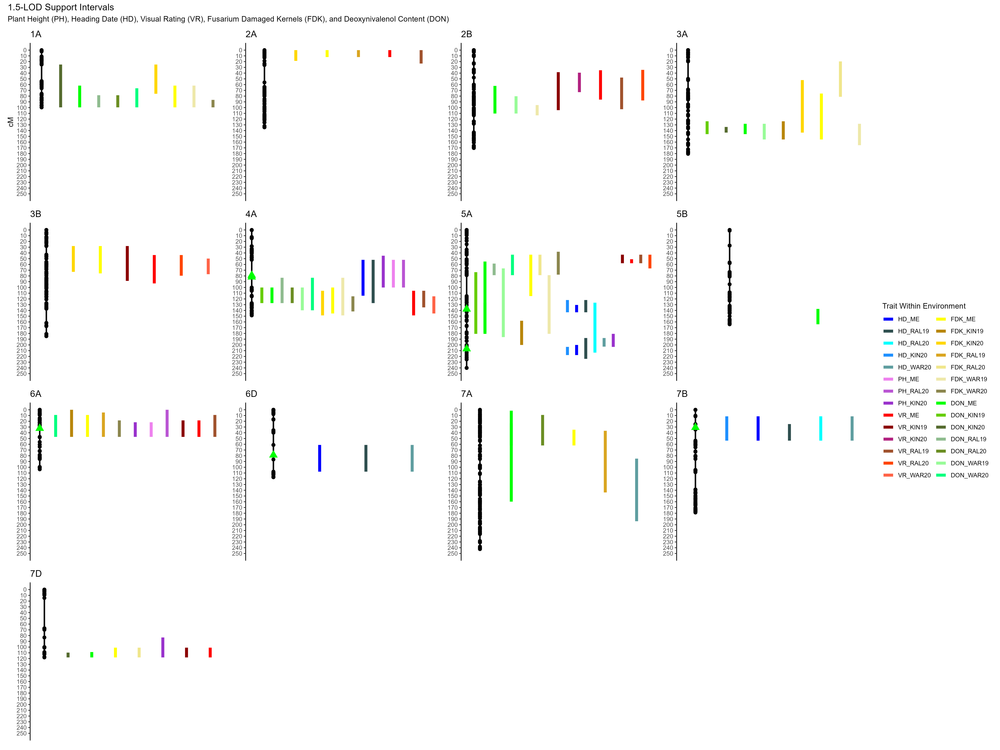

```{r setup, include=FALSE}
knitr::opts_chunk$set(echo = TRUE)
```

# Library and Write Function for R/qtl formatting

```{r}
# Load necessary libraries
library(gaston)
library(tidyverse)
library(asreml)
library(ASMap)
library(qtl)
library(psych)
library(knitr)
library(ggplot2)
library(patchwork)


# Write Brian's function
format_qtlmap_geno <- function(
                               bed, # A 'bed' formatted file (from the function gaston::read.vcf()) 
                               par_a, # Name of parent A (must be listed in bed file IDs)
                               par_b, # Name of parent B (must be listed in bed file IDs)
                               rm_het = TRUE, # If you want heterozygous calls removed
                               rm_miss = TRUE, # If you want missing data removed
                               include_pars = TRUE, # If you want to include the parents in the final dataframe
                               out_fmt = "rqtl" # What type of output you want to make 
                               ) {
  ### Sanity Checks ###
  # If parent a is not found in the bed file
  if (!(par_a %in% bed@ped$id)) {
    # Then throw error and stop
    stop("Parent A is not present in supplied bed matrix")
  }
  # If parent b is not found in the bed file 
  if (!(par_b %in% bed@ped$id)) {
    # Then throw error and stop
    stop("Parent B is not present in supplied bed matrix")
  }
  # If rm_het, rm_miss, and include_pars are not logical arguments
  if (!(is.logical(rm_het) & is.logical(rm_miss) & is.logical(include_pars))) {
    # Then throw error and stop
    stop("rm_het, rm_miss, and include_pars must be TRUE or FALSE")
  }
  # If the output format listed is not icimapping nor rqtl
  if (!(out_fmt %in% c("icimapping", "rqtl"))) {
    # Then throw error and stop
    stop("Please select either 'icimapping' or 'rqtl' for out_fmt")
  }

  # Make a new dataframe from the bed matrix 
  genomat <- as.data.frame(t(gaston::as.matrix(bed)))
  
  # Create new dataframe from genomat that is called "parents:
  parents <- data.frame(
    snp = rownames(genomat), # Name of the snps
    a = genomat[[par_a]], # Parent A genotype
    b = genomat[[par_b]], # Parent B genotype
    stringsAsFactors = FALSE # Make sure the strings are not factors
  )
  
  # Sum the parent haplotypes
  parents$sum <- parents$a + parents$b

  # Make a null object called drop_snps
  drop_snps <- NULL
  
  # Pull the union of SNPs that are the same between the parents
  drop_snps <- union(drop_snps, parents$snp[parents$a == parents$b])
  
  # If the user has indicated to remove hets
  if (rm_het) {
    # Then add those to the list of snps to drop
    drop_snps <- union(drop_snps, parents$snp[parents$a == 1 | parents$b == 1])
  } else {
    # Drop the snps where one parent is het and the other is missing
    drop_snps <- union(drop_snps, parents$snp[is.na(parents$a) & parents$b == 1])
    drop_snps <- union(drop_snps, parents$snp[parents$a == 1 & is.na(parents$b)])
  }
  
  # If the user has indicated to remove missing data
  if (rm_miss) {
    # Then add those markers with missing data in either parents to the list
    drop_snps <- union(drop_snps, parents$snp[is.na(parents$a) | is.na(parents$b)])
  } else {
    # Drop the snps where one parent has missing data to reduce ambiguity
    drop_snps <- union(drop_snps, parents$snp[is.na(parents$a) & is.na(parents$b)])
  }

  # Drop snps from genomat that are in drop_snps
  genomat <- genomat[!rownames(genomat) %in% drop_snps, ]
  
  # Do this for the bed file as well
  bed@snps <- bed@snps[!bed@snps$id %in% drop_snps, ]

  # Make an object of the snps where parent a is the minor allele 
  flip <- parents$snp[parents$a == 2]
  
  # Get a list of snps that are equal to zero for parent b and the sum is incalculable
  flip <- union(flip, parents$snp[is.na(parents$sum) & parents$b == 0])
  
  # Get a list of snps that are equal to 0 in the b parent and the sum is 1
  flip <- union(flip, parents$snp[parents$sum == 1 & parents$b == 0])
  
  # Drop any NAs from the flip vector
  flip <- flip[!is.na(flip)]

  # Any marker feautred in the flip vector will be turned into the parent A call
  genomat[flip, ] <- genomat[flip, ] - 2
  
  # We then take the absolute value so that |0-2|=2 for what was the major allele for the B parent
  genomat <- abs(genomat)

  # If the user indicated that they want to keep the parents in the resulting output
  if (include_pars) {
    # Make a vector of the names of all others in the population
    colorder <- setdiff(colnames(genomat), c(par_a, par_b))
    
    # Make a vector for column order so that the parents show up at the front
    colorder <- c(par_a, par_b, colorder)
    
    # Order the genotyping matrix as such
    genomat <- genomat[colorder]
  } else {
    # Get rid of both parents in the genotyping matrix
    genomat[c(par_a, par_b)] <- NULL
  }

  # Make a new column called id in the genotyping matrix
  genomat$id <- rownames(genomat)

  # If the user wants a genotyping matrix in the format acceptable to icimapping
  if (out_fmt == "icimapping") {
    # Then subtract everything by 1 so that the matrix is c(-1,0,1) coded
    genomat[is.na(genomat)] <- -1
    
    # Pull the id, chromosome, position, ref and alt alleles from the bed matrix
    id_df <- bed@snps[c("id", "chr", "dist", "pos", "A1", "A2")]
    
    # Merge that with the final output
    out_df <- merge(id_df, genomat, by = "id")
  } else {
    # Code 0 as A
    genomat[genomat == 0] <- "A"
    
    # Code 2 as B
    genomat[genomat == 2] <- "B"
    
    # Code 1 as H
    genomat[genomat == 1] <- "H"
    
    # Code NA as -
    genomat[is.na(genomat)] <- "-"
    
    # Make a new dataframe with id, chromosome, and dist
    id_df <- bed@snps[c("id", "chr", "dist")]
    
    # merge that with genomat
    out_df <- merge(id_df, genomat, by = "id")
    
    # make empty spaces
    names(out_df)[2:3] <- ""
  }
  
  # make an outlist of the genotyping matrix and a vector of the markers that were flipped 
  out_list <- list(abh = out_df, flipped = flip)
  
  # Return that output to the user
  return(out_list)
}
```


# Read in phenotypic data

```{r}
# Read in data
pheno <- read.csv("NC13955_Combined_Data_Final.csv")

# Read in potential selfs
selfs <- read.csv("list_of_potential_selfs.csv")

# Remove selfs
pheno <- pheno %>%
  filter(!GENOTYPE %in% selfs$GENOTYPE)

# Ensure the correct data types
pheno[, 1:7] <- lapply(pheno[, 1:7], as.factor)
pheno[, 8:ncol(pheno)] <- lapply(pheno[, 8:ncol(pheno)], as.numeric)
```

# Calculate BLUEs within and across environments

```{r}
# Set up lists for loop
env <- levels(pheno$ENV)
traits <- colnames(pheno)[8:12]

# Create dataframe for means output
BLUEs_loc <- data.frame(GENOTYPE = unique(pheno$GENOTYPE))

# Run models for each environment
for (i in env) {
  for (j in traits) {
    # Print message
    print_message <- paste("### Analyzing", j, "in", i, "###")
    print(paste(rep("#", nchar(print_message)), collapse = ""))
    print(print_message)
    print(paste(rep("#", nchar(print_message)), collapse = ""))
    
    # Read subset of phenotype data
    pheno_subset <- na.omit(pheno[pheno$ENV == i, c("GENOTYPE", "REP", j)])
    colnames(pheno_subset)[3] <- "Y"
    
    # Check if subset is empty
    if (nrow(na.omit(pheno_subset)) == 0) {
      # Throw message
      print(paste("###", j, "not taken in", i, "moving on..."))
      remove(pheno_subset)
      next
    }
    
    # If the trait is abnormally distributed
    if (j %in% c("FHB", "FDK", "DON")) {
      # Run model and pull estimates
      fit <- asreml(fixed = Y ~ GENOTYPE,
                    random = ~ REP,
                    residual = ~ units,
                    data = pheno_subset,
                    family = asr_poisson(),
                    maxit = 75)
      
      # Check if model converges and if it results in critial error, default to RCBD with normal distribution
      if (fit$converge == FALSE | (i == "WAR20" & j == "FHB")) {
        # Fit model
        fit <- asreml(fixed = Y ~ GENOTYPE,
                      random = ~ REP,
                      residual = ~ units,
                      data = pheno_subset,
                      maxit = 75)
        # Update model
        fit <- update.asreml(fit)
      }
      
      # Get quick summary (comment out for markdown) 
      # print(summary(fit))
      # print(plot(fit))
      
      # Pull BLUEs
      pred <- predict(fit, classify = "GENOTYPE", maxit = 75)$pvals[, c("GENOTYPE", "predicted.value")]
      
      # Rename
      colnames(pred)[2] <- paste(j, "_", i, sep = "")
      
      # Bind
      BLUEs_loc <- left_join(BLUEs_loc, pred, by = "GENOTYPE")
    } else {
      # Run model and pull estimates 
      fit <- asreml(fixed = Y ~ GENOTYPE,
                    random = ~ REP,
                    residual = ~ units,
                    data = pheno_subset)
      
      # Get quick summary (comment out for markdown) 
      # print(summary(fit))
      # print(plot(fit))
      
      # Get BLUEs
      pred <- predict(fit, classify = "GENOTYPE")$pvals[, c("GENOTYPE", "predicted.value")]
      
      # Rename
      colnames(pred)[2] <- paste(j, "_", i, sep = "")
      
      # Bind
      BLUEs_loc <- left_join(BLUEs_loc, pred, by = "GENOTYPE")      
    }
    # Remove temporary objects
    remove(pheno_subset, fit, pred)
  }
}
```

# Multi-environmental models

```{r}
# Define traits
traits <- colnames(pheno)[8:12]

# Create dataframe for predictions
BLUEs_mem <- data.frame(GENOTYPE = unique(pheno$GENOTYPE))

# Run MEMLM loop for each trait
for (i in traits) {
  
  # Print message
  print_message <- paste("### Analyzing", i, "###")
  print(paste(rep("#", nchar(print_message)), collapse = ""))
  print(print_message)
  print(paste(rep("#", nchar(print_message)), collapse = ""))
  
  # Subset data
  pheno_subset <- na.omit(pheno[, c("GENOTYPE", "YEAR", "ENV", "REP", i)])
  
  # Redefine data types
  pheno_subset[, 1:4] <- lapply(pheno_subset[, 1:4], as.factor)
  pheno_subset[, 5] <- as.numeric(pheno_subset[, 5])
  colnames(pheno_subset)[5] <- "Y"
  
  # Run mixed effects model
  if (i %in% c("FHB", "FDK", "DON")) {
    # Fit model with Poisson distribution
    fit <- asreml(fixed = Y ~ GENOTYPE,
                  random = ~ REP:ENV + GENOTYPE:ENV,
                  residual = ~ units,
                  data = pheno_subset,
                  family = asr_poisson(),
                  maxit = 75)
    
  } else {
    # Fit model with normal distribution
    fit <- asreml(fixed = Y ~ GENOTYPE,
                  random = ~ REP:ENV + GENOTYPE:ENV,
                  residual = ~ units,
                  data = pheno_subset,
                  #family = asr_poisson(),
                  maxit = 75)
      
  }
  
  # Get quick summary (comment out for markdown) 
  # print(summary(fit))
  # print(plot(fit))

  # Get predictions
  pred <- predict(fit, classify = "GENOTYPE")$pvals[, 1:2]
  colnames(pred)[2] <- paste(i, "ME", sep = "_") 
  
  # Left join predictions to main dataframe
  BLUEs_mem <- left_join(BLUEs_mem, pred, by = "GENOTYPE")
  
  # Remove temporary objects
  remove(pheno_subset, fit, pred)
}

# Select specific traits from the results
BLUEs_mem <- BLUEs_mem %>%
  select(GENOTYPE, FHB_ME, FDK_ME, DON_ME, HD_ME, PH_ME)
```

# Heritabilities

```{r}
# Make an empty data frame for the heritability estimates
h2s <- data.frame(Trait = character(), 
                  Type = character(), 
                  Estimation = numeric(), 
                  SE = numeric())

# Calculate the harmonic means for each trait
e_traits <- list()
r_traits <- list()

for (j in traits) {
  # Subset data and only take complete case
  a <- pheno %>% 
    drop_na(all_of(j))
  
  # Get the number of observations per genotype
  obs_per_ind <- aggregate(a[, j] ~ GENOTYPE, 
                           data = a,
                           length)
  
  # Calculate the harmonic mean of replications
  r <- (1 / mean(1 / obs_per_ind$`a[, j]`))
  
  # Put that in an object
  r_traits[j] <- r
  
  # Create a new object called e
  e <- c()
  
  # For every genotype in the phenotypic dataset 
  for (i in unique(pheno$GENOTYPE)) {
    # Get every observation in every environment
    a <- na.omit(pheno[pheno$GENOTYPE == i, c("ENV", j)])
    
    # Get get the number of environments that the genotype was observed in
    a <- length(unique(a$ENV))
    
    # If the number of environments equals 0, then 0, if it is greater than that, do 1 / number of environments
    a <- ifelse(a == 0, 0, 1 / a)
    
    # Add this value to the vector e
    e <- rbind(e, a)
  }
  
  # Take the reciprocal of the value e to get the harmonic mean of environments
  e_traits[j] <- (1 / mean(e)) 
  
  # Remove all the little things
  remove(a, obs_per_ind, r, e)
}

# Loop through each trait for heritability estimation
for (i in traits) {
  # Print message
  print_message <- paste("### Analyzing", i, "###")
  print(paste(rep("#", nchar(print_message)), collapse = ""))
  print(print_message)
  print(paste(rep("#", nchar(print_message)), collapse = ""))
  
  # Determine number of locations
  n_loc <- pheno %>% 
    select(ENV, YEAR, LOC, all_of(i)) %>% 
    drop_na() %>% 
    distinct(ENV)
  n_loc <- as.numeric(nrow(n_loc))
  
  # Determine the number of replications
  n_rep <- n_loc * 2
  
  # Determin the number of years
  n_year <- pheno %>% 
    select(ENV, YEAR, LOC, all_of(i)) %>% 
    drop_na() %>% 
    distinct(YEAR)
  n_year <- as.numeric(count(n_year))
  
  # Get the harmonic mean of environments
  e <- as.numeric(e_traits[i])
  
  # Get the harmonic mean of replications
  r <- as.numeric(r_traits[i])
  
  # If the trait has been observed over many years
  if (n_year >= 2) {
    # If the trait is a disease reaction trait
    if (i %in% c("FHB", "FDK", "DON")) {
      # Run model for Poisson distributed traits
      mlm <- asreml(fixed = pheno[, i] ~ 1,
                    random = ~ GENOTYPE +
                      ENV +
                      GENOTYPE:ENV,
                    residual = ~ idv(units),
                    data = pheno,
                    maxit = 75,
                    family = asr_poisson())
    } else {
      # Run model for normally distributed traits
      mlm <- asreml(fixed = pheno[, i] ~ 1,
                    random = ~ (GENOTYPE) +
                      ENV +
                      GENOTYPE:ENV,
                    residual = ~ idv(units),
                    data = pheno,
                    maxit = 75)
    }
  # If the trait has been only observed in one year
  } else {
    # Run model for single year data
    mlm <- asreml(fixed = pheno[, i] ~ 1,
                  random = ~ (GENOTYPE) +
                    ENV +
                    GENOTYPE:ENV,
                  residual = ~ idv(units),
                  data = pheno,
                  maxit = 75)
  }
  
  # Print summary of variance components
  print(summary(mlm)$varcomp)
  
  # Predict heritability estimates
  pph2 <- vpredict(mlm, 
                   h2 ~ V2 / (V2 + V3 + V4))
  
  emh2 <- vpredict(mlm,
                   h2 ~ V2 / (V2 + (V3 / e) + (V4 / (e * r))))
  
  # Bind predictions to h2s data frame
  a <- rbind(pph2, emh2)
  a <- cbind(data.frame(Trait = c(i, i)), data.frame(Type = c("Per-Plot", "Entry-Mean")), a)
  h2s <- rbind(h2s, a)
  
  # Remove the little things
  remove(mlm, pph2, emh2, n_loc, n_rep, n_year, e, r, a)
}

# Write heritability out
write.csv(h2s,
          "heritability.csv",
          row.names = FALSE)
```

# Make the rQTL file

```{r}
# Read in genetic information from VCF file
geno <- read.vcf("NC13-20076xGA06493-13LE6_filt.vcf.gz", convert.chr = FALSE)

# Convert genotype matrix to format suitable for rqtl
geno <- format_qtlmap_geno(geno, 
                            par_a = "13955-GA06493-13LE6",
                            par_b = "13955-NC13-20076",
                            rm_het = TRUE, 
                            rm_miss = TRUE, 
                            include_pars = TRUE, 
                            out_fmt = "rqtl")$abh

# Replace heterozygous calls with missing data
geno <- replace(geno, geno == "H", "-")

# Manipulate the genetic file to match rqtl's format requirements
geno <- as.data.frame(t(geno))
colnames(geno) <- geno[1, ]
geno <- geno[-1, ]
geno <- cbind(substr(gsub("[.]", "-", rownames(geno)), start = 2, stop = nchar(rownames(geno))), geno)
rownames(geno) <- NULL
geno <- rownames_to_column(geno, var = "dummy")  # Create a dummy column to sort later on
geno$dummy <- as.numeric(geno$dummy)
colnames(geno)[2] <- "GENOTYPE"
geno[1:2, 2] <- ""

# Merge all the BLUEs
BLUEs_all <- left_join(BLUEs_mem, BLUEs_loc, by = "GENOTYPE")

# Merge the phenotype and genotype files
insertme <- full_join(BLUEs_all, geno, by = "GENOTYPE")
insertme <- insertme[order(insertme$dummy), ]  # Order by dummy
insertme <- insertme[1, ]
pheno_geno <- left_join(BLUEs_all, geno, by = "GENOTYPE")
pheno_geno <- rbind(insertme, pheno_geno)
pheno_geno <- pheno_geno[order(pheno_geno$dummy), ]  # Order by dummy
pheno_geno <- pheno_geno %>% filter(!is.na(dummy))  # Get rid of any genotype that is not present
pheno_geno[1, (1:30)] <- ""  # Replace any NAs with blank data
dropme <- c("13955-AGS-2026", "13955-JAMESTOWN", "13955-NCAG11", "13955-NC13-20076", "13955-GA06493-13LE6")
pheno_geno <- pheno_geno[!(pheno_geno$GENOTYPE %in% dropme), ]
pheno_geno <- pheno_geno %>%
  select(-dummy)
colnames(pheno_geno) <- gsub("FHB", "VR", colnames(pheno_geno))

# Write out rqtl input file
write.csv(pheno_geno,
          "rqtl_input_file.csv",
          row.names = FALSE)
```

# Make a pairs plot of traits

```{r}
# Create temp 
pairs_plot_dat<-BLUEs_mem

# Rename columns for the pairs plot
colnames(pairs_plot_dat) <- c("Genotype",
                              "Visual Rating (1-9)",
                              "Fusarium Damaged Kernels (%)",
                              "Deoxynivalenol Content (PPM)",
                              "Heading Date (Days)",
                              "Plant Height (cm)")

# Visualize first
pairs.panels(pairs_plot_dat[,2:ncol(pairs_plot_dat)],
             hist.col = "gray",
             lm = TRUE,
             stars = TRUE,
             digits = 2,
             density = FALSE,
             ellipses = FALSE)

# Set up JPEG file
jpeg(filename = "pairs_plot.jpg",
     width = 9,
     height = 9,
     units = "in",
     res = 320)

# Create pairs plot
pairs.panels(pairs_plot_dat[,2:ncol(pairs_plot_dat)],
             hist.col = "gray",
             lm = TRUE,
             stars = TRUE,
             digits = 2,
             density = FALSE,
             ellipses = FALSE)

# Save and close JPEG file
dev.off()
```

# Build Linkage Map

```{r}
# Read in file
cross_file <- read.cross("csv", 
                         file = "rqtl_input_file.csv",
                         genotypes = c("A", "B", "-"), 
                         alleles = c("A", "B"), 
                         crosstype = "dh")

# Remove markers with low P-value from a file
toss_me <- read.table("markers_to_remove.txt")[, 1]
gt <- geno.table(cross_file)
toss_me <- unique(c(toss_me, rownames(gt[gt$P.value < 0.0001, ])))
cross_file <- drop.markers(cross_file, toss_me)

# Remove unnecessary objects
remove(gt, toss_me)

# Chromosome names
chromosomes <- c(paste0("1", LETTERS[c(1,2,4)]),
                 paste0("2", LETTERS[c(1,2,4)]),
                 paste0("3", LETTERS[c(1,2,4)]),
                 paste0("4", LETTERS[c(1,2,4)]),
                 paste0("5", LETTERS[c(1,2,4)]),
                 paste0("6", LETTERS[c(1,2,4)]),
                 paste0("7", LETTERS[c(1,2,4)]))

# Create genetic map with cM instead of BP
cross_file <- mstmap(cross_file,
                     pop.type = "dh",
                     id = "GENOTYPE",
                     chr = chromosomes,
                     anchor = TRUE,
                     detectBadData = TRUE,
                     bychr = TRUE,
                     miss.thresh = 0.15,
                     mvest.bc = FALSE)

# Jitter map to improve marker distances
cross_file <- jittermap(cross_file)

# Subset and filter linkage groups
marker_count <- sapply(cross_file$geno, function(x) length(x$map))
marker_count <- data.frame(Chr = names(marker_count), n = marker_count) %>%
  filter(n > 6 & !Chr %in% c("1A.2", "6A.2"))
cross_file <- subset(cross_file, chr = marker_count$Chr)
cross_file <- jittermap(cross_file)

# Rename linkage groups
names(cross_file$geno) <- chromosomes

# Remove unnecessary objects
remove(marker_count)

# Check map metrics
nphe(cross_file)
nind(cross_file)
nchr(cross_file)
summary(cross_file)

# Plot linkage map
plotMap(cross_file, horizontal = FALSE, shift = FALSE, main = "NC13-20076 Double Haploid Linkage Map")

# Function to compare cM vs BP position
compare_bp_to_cm <- function(x){
  # Pull marker names
  mn <- markernames(x)
  
  # Pull positions of markers
  pos <- find.markerpos(x, mn)
  
  # Pull in rownames
  pos <- rownames_to_column(pos, var = "BP_Location")
  
  # Split the column BP_Location into a and b
  pos <- tidyr::separate(pos, BP_Location, into = c("a", "b"), sep = "_")
  
  # Rename columns
  colnames(pos) <- c("trash", "BP", "Chr", "cM")
  
  # Pull the three columns listed
  pos <- pos[, c("Chr", "BP", "cM")]
  
  # Bind marker names with their chromosme and positions
  pos <- cbind(mn, pos)
  
  # Rename columns
  colnames(pos) <- c("Markers", "Chr", "BP", "cM")
  
  # Make sure the BP and cM positions are numeric columns
  pos[, 3:4] <- lapply(pos[, 3:4], as.numeric)
  
  # Return the position dataframe 
  return(pos)
}

# Compare cM vs BP for each chromosome
pos <- compare_bp_to_cm(cross_file)

# Check and flip chromosome order if necessary
for (i in names(cross_file$geno)) {
  # Make an object that has only the curren chromosome
  q <- pos %>% filter(Chr == i)
  # If the first makrer pysical positon is greater than the last marker pysical position
  if (q[1, 3] > q[nrow(q), 3]) {
    # Print message
    print_message <- paste(paste("### Chromosome", i, "has been flipped ###"))
    print(paste(rep("#", nchar(print_message)), collapse = ""))
    print(print_message)
    print(paste(rep("#", nchar(print_message)), collapse = ""))
    
    # Then flip the linkage group
    cross_file <- flip.order(cross_file, i)
    
    # Remove the temporary dataframe 
    remove(q, print_message)
  } else {
    # Remove the temporary dataframe 
    remove(q)
  }
}

# Re-calculate positions after potential flipping
pos <- compare_bp_to_cm(cross_file)

# Plot cM vs BP again
ggplot(data = pos, aes(x = cM, y = BP / 1000000)) +
  geom_point() +
  facet_wrap(~Chr, ncol = 3, scales = "fixed") +
  coord_cartesian(ylim = c(0, 800), xlim = c(0, 250)) +
  labs(title = "Centimorgan Position vs. Megabase Pair",
       x = "Centimorgan (cM) Position",
       y = "Megabase Pair (Mbp) Position")

# Save the plot
ggsave(plot = last_plot(),
       filename = "cM_vs_bp_comparison.jpg",
       units = "in", width = 8, height = 12, dpi = 320)

# Remove temporary objects
remove(pos)

# Write final cross file
write.cross(cross_file,
            format = "csv",
            filestem = "rqtl_input_file_final")
```

# Find potential selfs 

```{r}
# # Find potential selfs
# potential_selfs <- pull.geno(cross_file)
# rownames(potential_selfs) <- cross_file$pheno$GENOTYPE
# potential_selfs <- t(potential_selfs)
# 
# # make a function to get counts
# count_values <- function(column) {
#   return(c(count_A = sum(column == 1, na.rm = TRUE),
#            count_B = sum(column == 2, na.rm = TRUE),
#            count_NA = sum(is.na(column))))
# }
# 
# # Make an object to bind on 
# check <- c()
# 
# # Bind in 
# for(i in 1:ncol(potential_selfs)){
#   
#   temp1<-data.frame(GENOTYPE=colnames(potential_selfs)[i],
#                     t(count_values(potential_selfs[,i])))
#   temp1$x2<-c(chisq.test(x = temp1[,2:3], p = rep(0.5, 2))$statistic)
#   temp1$p.value<-c(chisq.test(x = temp1[,2:3], p = rep(0.5, 2))$p.value)
#   check <-rbind(check, temp1)
#   remove(temp1)
#   
# }
# 
# # List of potential selfs
# potential_selfs <- check %>% filter(p.value<=1e-80)
# 
# # Write selfs
# write.csv(potential_selfs,
#           "list_of_potential_selfs.csv",
#           row.names = FALSE)
```

# QTL analysis without covariates - HD, PH, VR, FDK, DON

```{r}
# Calculate marker probabilities
cross_file<-calc.genoprob(cross_file, 
                          step=2.0, 
                          off.end=0.0, 
                          error.prob=1.0e-4, 
                          map.function="kosambi",
                          stepwidth="fixed")

# Calculate marker probabilities for a simulated genotype
cross_file<-sim.geno(cross_file, 
                     n.draws = 128, 
                     step = 2, 
                     off.end = 0.0, 
                     error.prob=1.0e-4, 
                     map.function="kosambi", 
                     stepwidth="fixed")

# Set the number of permutations
nperms=1000

# Pull traits
traits<-names(cross_file$pheno)[-1]

# Covariates - set to null if none are specified 
qtl_covariates <- NULL

# Make results vector
results<-list()

# Run initial interval mapping and pull out QTL
for (i in traits){
  
  # Announce 
  print(paste("------------ Interval Mapping of", i,"------------"))
  
  # Perform IM with multiple imputation method
  print("Interval mapping...")
  scans <- scanone(cross_file, 
                   pheno.col = i,
                   addcovar = qtl_covariates,
                   model = "normal", 
                   method = "hk") 
  print("Done")
  
  # Perform IM permutations mapping to define significance threshold
  print("Permutational interval mapping...")
  perms <- scanone(cross_file, 
                   pheno.col = i, 
                   addcovar = qtl_covariates,
                   model = "normal", 
                   method = "hk", 
                   n.perm = nperms, 
                   n.cluster = parallel::detectCores()-1) #set threshold
  print("Done")
  
  # Plot QTL Scan
  print("Plotting...")
  threshold <- summary(perms, alpha=0.05)
  plot(scans,main=paste("IM for", i)) 
  abline(h = threshold, lty = "dotted", lwd = 1, col="#cc0000")
  legend("topleft",legend = c("p=0.05"),col = c("#cc0000"),lty = "dotted")
  
  # Print plot
  jpeg(paste("Scan_IM_", i, ".jpg", sep = ""),
       width = 11,
       height = 4,
       units = "in",
       res = 320)
  threshold <- summary(perms, alpha=0.05)
  plot(scans, main = paste("IM for", i)) 
  abline(h = threshold, lty = "dotted", lwd = 1, col = "#cc0000")
  legend("topleft",legend = c("p=0.05"),col = c("#cc0000"),lty = "dotted")
  dev.off()
  print("Done")
  
  # Show the peak markers for QTL
  print("Defining QTL...")
  qtl <- summary(scans, 
                 perm = perms, 
                 lodcolum = 1, 
                 alpha=0.05)
  
  # Place outputs in lists
  results$IM$scan[[i]] <- scans # Place the scan a the list
  results$IM$perms[[i]] <- perms # Place the permutations a the list
  results$IM$threshold[[i]] <- threshold # Place the thresholds a the list
  
  # If not QTL is found
  if(nrow(qtl)==0){
    # Print out
    print("No QTL identified in initial scan... Moving onto next trait!")
    next
  }
  
  # Rename QTL to identify which scan they came from
  qtl$name <- paste("IM_", qtl$chr, "-pos-", qtl$pos, sep = "")
  print("Done")
  
  # Define the QTL locations and effects
  print("Drawing QTL...")
  colnames(scans) <- c("chr", "pos", "lod")
  
  # Set up objects for defining QTL
  c <- qtl[,1] # Define the chromosomes where QTL are found
  p <- qtl[,2] # Define the positions of the QTL
  a <- subset(cross_file, chr=c) # Subset the chromosomes where QTL are found
  
  # Make new cross with genome subset
  a <- sim.geno(a, 
                n.draws = 128, 
                step = 2, 
                off.end = 0.0, 
                error.prob = 1.0e-4, 
                map.function = "kosambi", 
                stepwidth = "fixed")
  
  # Make a QTL object from that subset
  madeqtl <- makeqtl(a, 
                     c, 
                     p, 
                     qtl.name = qtl[,4], 
                     what = c("prob")) 

  # Place that QTL object in a list
  results$IM$qtl[[i]] <- madeqtl 
  print("Done")
  
  # Announce
  print("Running drop-one QTL analysis to check significance...")
  
  # Test the significance of those QTL using drop one analysis
  qtlfit <- fitqtl(cross_file, 
                   qtl = results$IM$qtl[[i]], 
                   pheno.col = i,
                   model = "normal", 
                   method = "hk") 
  
  # Remove insignificant QTL
  if(!is.null(qtlfit$result.drop)){
    # Make an object of the drop results of the fit QTL object
    a <- as.data.frame(qtlfit$result.drop)
    
    # Find the insignificant QTL
    a$sig <- ifelse(a$`Pvalue(F)`<0.05, 1, 0)
    
    # Make a dataframe with insignificant QTL
    a <- data.frame(name = rownames(a[a$sig==0,]))
    
    # Drop those QTL
    madeqtl <- dropfromqtl(madeqtl,
                           qtl.name = a$name)
    
    # Put that in object
    results$IM$qtl[[i]] <- madeqtl 
    
    # Remove temporary 
    remove(a,c,p,scans,perms,threshold)
  }else{
    # Remove temporary dataframes
    remove(a,c,p,scans,perms,threshold)
  }
  
  # Set vectors outside the loop
  j=1
  
  # Make initial check object
  qtl_check<-results$IM$qtl[[i]]
  
  # Run MQM until no significant peaks
  repeat{
    
    # Announce  
    print(paste("-------- Performing Additional QTL Scan for Trait", i,"--------"))
    
    # Run multiple QTL mapping
    mqm <- addqtl(cross = cross_file, 
                  pheno.col = i, 
                  qtl = qtl_check, 
                  covar = qtl_covariates, 
                  method = "hk")
    
    # Put that in the list
    results[[paste("MQM", j, sep="")]]$scan[[i]] <- mqm
    
    # Plot QTL Scan
    print("Plotting...")
    plot(mqm, main = paste("MQM", j, "for", i)) 
    abline(h = results$IM$threshold[[i]], lty = "dotted", lwd = 1, col = "#cc0000")
    legend("topleft",legend = c("p=0.05"),col = c("#cc0000"),lty = "dotted")
    print("Done")
    
    # Write out picture to directory
    jpeg(paste("Scan_",paste("MQM", j, sep=""),"_", i, ".jpg", sep = ""),
     width = 11,
     height = 4,
     units = "in",
     res = 320)
    plot(mqm, main = paste("MQM", j, "for", i)) 
    abline(h = results$IM$threshold[[i]], lty = "dotted", lwd = 1, col = "#cc0000")
    legend("topleft",legend = c("p=0.05"),col = c("#cc0000"),lty = "dotted")
    dev.off()

    #make a qtl object
    qtl <- summary(mqm, 
                   perm = results$IM$perms[[i]], 
                   lodcolum = 1, 
                   alpha = 0.05)
  
    if(nrow(qtl)==0){
      # Make a null object in the list of list
      results[[paste("MQM", j, sep = "")]]$qtl[[i]] <- NULL
      
      # Announce
      print(paste("There were no new QTL identified for", i, "aborting loop"))
      
      # Break the loop
      break
    }else{
      # Rename QTL to identify which scan they came from
      qtl$name=paste(paste("MQM", j, "_", sep=""), qtl$chr,"-pos-",qtl$pos,sep="")
       
      # Defining QTL
      print("Drawing new QTL")
      c<-qtl[,1] # Define the chromosomes where QTL are found
      p<-qtl[,2] # Define the positions of the QTL
      a<-subset(cross_file, chr=c) # Subset the chromosomes where QTL are found
       
      # Simulate the genome for that subset
      a <- sim.geno(a, 
                    n.draws = 128, 
                    step = 2, 
                    off.end = 0.0, 
                    error.prob = 1.0e-4, 
                    map.function = "kosambi", 
                    stepwidth = "fixed") 
       
      # Make a QTL object from that subset
      madeqtl <- makeqtl(a, 
                         c, 
                         p, 
                         qtl.name = qtl[,4], 
                         what = c("prob")) 
   
      # Place that QTL object in a list
      results[[paste("MQM", j, sep = "")]]$qtl[[i]] <- madeqtl 
      print("Done")
      
      # Announce
      print("Running drop-one QTL analysis...")
       
      # Test the significance of those QTL using dropone analysis
      qtlfit <- fitqtl(cross_file, 
                       qtl = madeqtl, 
                       pheno.col = i, 
                       get.ests = T,
                       model = "normal", 
                       method = "hk") 
      
      # Check results
      if(!is.null(qtlfit$result.drop)){
        # Announce
        print("Checking drop-one analysis for significance")
        
        # Make a dataframe of the drop results
        a <- as.data.frame(qtlfit$result.drop)
        
        # Check significance 
        a$sig <- ifelse(a$`Pvalue(F)`<0.05, 1, 0)
        
        # Check significance 
        a <- data.frame(name=rownames(a[a$sig==0,]))
        
        # Separate the column name into sections 
        a <- tidyr::separate(data = a, 
                             col = "name",
                             into = c("chr", "trash", "pos"),
                             sep = "-")
        
        # Make sure position is a number
        a$pos <- as.numeric(a$pos)
        
        # Make the chromosome object from the trait
        a$chr <- gsub(paste("MQM", j, "_", sep = ""),"",a$chr)
        
        # Drop the insignificant QTL from the object
        madeqtl <- dropfromqtl(madeqtl,
                               chr = a$chr,
                               pos = a$pos)
        
        # Add the significant QTL to the object
        madeqtl <- addtoqtl(cross_file,
                            qtl = madeqtl,
                            chr = qtl_check$chr,
                            pos = qtl_check$pos,
                            qtl.name = qtl_check$name)
              
        
        # Add this QTL object to the list of list
        results[[paste("MQM", j, sep="")]]$qtl[[i]] <- madeqtl 
        
        # Remove temporary dataframes
        remove(a, c, p)
        }else{
          # Announce 
          print(paste("There was only one new QTL identified for ",
                      i,
                      " in ", 
                      paste("MQM", j, sep = ""),
                      "... Checking significance!",
                      sep = ""))
          
          # If this QTL is significant
          if(qtlfit$result.full[1,6]<0.05){
            # Announce
            print("New QTL is significant, placing in total model!")
            
            # Add that significant peak to the QTL object
            madeqtl <- addtoqtl(cross_file,
                                qtl = madeqtl,
                                chr = qtl_check$chr,
                                pos = qtl_check$pos,
                                qtl.name = qtl_check$name)
            
            # Add the object to the list of list
            results[[paste("MQM", j, sep = "")]]$qtl[[i]] <- madeqtl 
            }else{
              # Make the multiple QTL model NULL
              results[[paste("MQM", j, sep = "")]]$qtl[[i]] <- NULL 
              
              # Announce
              print(paste("There were no new QTL identified for", i, "concluding loop."))
              
              # Break loop 
              break
            }
          }
        }
      
    
    # Add result to object to check
    qtl_check <- results[[paste("MQM", j, sep="")]]$qtl[[i]]
    
    # Add 1 to the j vector to indicate what round we are on
    j=j+1
  }
  
  # Check
  if(j-1==0){
    # Pull and make final qtl object
    finalqtl <- results$IM$qtl[[i]]
  }else{
    # Pull and make final qtl object
    finalqtl <- results[[paste("MQM", j-1, sep="")]]$qtl[[i]]
      
  }
  
  # Check for significance
  qtlfit <- fitqtl(cross_file, 
                   qtl = finalqtl, 
                   pheno.col = i, 
                   get.ests = T,
                   model = "normal", 
                   method = "hk") 
  
  # Rename the QTL
  a <- finalqtl
  a <- data.frame(summary(a))
  a <- tidyr::separate(a, col = "name", into=c("model", "trash"), sep = "_")
  a$name <- paste(a$model, "_", a$chr, "-pos-", a$pos, sep = "")
  finalqtl$name = a$name
  remove(a)
  
  # Announce
  print("Filtering insignificant markers...")
  
  # If there are drop one analysis results
  if(!is.null(qtlfit$result.drop)){
    # Pull results into a dataframe
    a <- as.data.frame(qtlfit$result.drop)
    
    # Find the significant QTL
    a$sig <- ifelse(a$`Pvalue(F)`<0.05, 1, 0)
    
    # Select the insignificant markers 
    a <- data.frame(name=rownames(a[a$sig==0,]))
    
    # Remove those QTL from the final QTL object
    finalqtl <- dropfromqtl(finalqtl,
                            qtl.name = a$name)
    
    # Add this to the list of list
    results$final$qtl_unrefine[[i]] <- finalqtl 
    
    # Remove the object
    remove(a, finalqtl)
  }else{
    # Put the final object in the list of list
    results$final$qtl_unrefine[[i]] <- finalqtl
    
    # Remove the object finalqtl
    remove(finalqtl)
  }
   
  # Announce
  print("Refining QTL position...")
  
  # Refine the QTL with the refine 
  results$final$qtl_refine[[i]] <- refineqtl(cross = cross_file, 
                                             pheno.col = i, 
                                             qtl = results$final$qtl_unrefine[[i]], 
                                             verbose = FALSE,
                                             method = "hk")
  # Rename the QTL
  a <- results$final$qtl_refine[[i]]
  a <- data.frame(summary(a))
  a <- tidyr::separate(a, col = "name", into=c("model", "trash"), sep = "_")
  a$name <- paste(a$model, "_", a$chr, "-pos-", a$pos, sep = "")
  results$final$qtl_refine[[i]]$name <- a$name
  remove(a)
  
  # Final significance check
  qtlfit <- fitqtl(cross_file, 
                   qtl = results$final$qtl_refine[[i]], 
                   pheno.col = i, 
                   get.ests = T,
                   model = "normal", 
                   method = "hk") 
  
  # Put the final QTL object into finalqtl
  finalqtl <- results$final$qtl_refine[[i]]
  
  # If there are drop one analysis results
  if(!is.null(qtlfit$result.drop)){
    # Pull results into a dataframe
    a <- as.data.frame(qtlfit$result.drop)
    
    # Find the significant QTL
    a$sig <- ifelse(a$`Pvalue(F)`<0.05, 1, 0)
    
    # Select the insignificant markers 
    a <- data.frame(name=rownames(a[a$sig==0,]))
    
    # Remove those QTL from the final QTL object
    finalqtl <- dropfromqtl(finalqtl,
                            qtl.name = a$name)
    
    # Add this to the list of list
    results$final$qtl_refine_filt[[i]] <- finalqtl 
    
    # Remove the object
    remove(a, finalqtl)
  }else{
    # Put the final object in the list of list
    results$final$qtl_refine_filt[[i]] <- finalqtl
    
    # Remove the object finalqtl
    remove(finalqtl)
  }
   
  # Create an object for support LOD internvals 
  droplodint<-c()
  
  #create QTL 1.5 drop LOD intervals
  for(z in results$final$qtl_refine_filt[[i]]$name){
    # Pull data for specific QTL
    a <- data.frame(name = z)
    
    # Pull the scan name 
    a <- tidyr::separate(data = a,
                         col = "name",
                         into = c("scan", "other"),
                         sep = "_",
                         remove = FALSE)
    
    # Pull the position name
    a <- tidyr::separate(data = a,
                         col = "other",
                         into = c("chr", "trash", "pos"),
                         sep = "-",
                         remove = TRUE)
    
    # Pull the relevant scan 
    b <- results[[a$scan]]$scan[[i]]
    
    # Find the nearest sudo marker to the LOD peak
    c <- find.pseudomarker(cross = cross_file,
                           chr = a$chr,
                           pos = as.numeric(a$pos))
    
    # Pull the confidence interval for 1.5 LOD drop
    d <- lodint(results = b,
                chr = a$chr,
                qtl.index = c,
                drop = 1.5,
                lodcolumn = 1,
                expandtomarkers = TRUE)
    
    # Create a dataframe with that data
    d <- data.frame(name = z, 
                    trait = i,
                    chr = unique(d$chr),
                    start_marker = rownames(d)[1],
                    start = d[1,2], 
                    mid_marker = rownames(d)[2],
                    mid_pos = d[2,2],
                    stop_marker = rownames(d)[3],
                    stop = d[3,2])
    
    # Bind into lodint object
    droplodint <- rbind(droplodint, d)
    
    # Remove temporary data
    remove(a,b,c,d)
  }
  
  # Place in results
  results$final$qtl_support_intervals[[i]] <- droplodint
  
  # Remove
  remove(droplodint)
  
}

# Rename results
results_HD_PH_VR_FDK_DON<-results

# Remove results
remove(results)
```

# Pull HD and PH Marker Covariates

```{r}
# Pull QTL Support Intervals
covars <- rbind(results_HD_PH_VR_FDK_DON$final$qtl_support_intervals$HD_ME,
                results_HD_PH_VR_FDK_DON$final$qtl_support_intervals$PH_ME)

# Make a dataframe 
covar_markers <- data.frame(GENOTYPE = cross_file$pheno$GENOTYPE)

# For each QTL support intervals
for(i in 1:nrow(covars)){
  # Take this row
  a <- covars[i,]
  
  # Then fill in the genome
  b <- fill.geno(cross = cross_file,
                 method = c("no_dbl_XO"),
                 map.function = "kosambi")
  
  # Pull the cross for the specific genome
  b <- pull.geno(cross = b,
                 chr = a$chr)
  
  # Pull the marker name
  a <- find.marker(cross = cross_file,
                   chr = a$chr,
                   pos = a$mid_pos)
  
  # Pull the data frame
  b <- as.data.frame(b[,a])
  
  # Rename the column
  colnames(b) <- a
  
  # Bind it into the dataframe
  covar_markers <- cbind(covar_markers, b)
  
  # Remove the temporary data
  remove(a, b)
}
```

# Visualize HD and PH QTL

```{r}
# Pull vector of traits
traits <- names(cross_file$pheno)[c(grep("HD", names(cross_file$pheno)),
                                    grep("PH", names(cross_file$pheno)))]

# Make a color pallet
color_palette <- c(
  "HD_ME" = "#0000FF",        # Blue
  "HD_RAL19" = "#2F4F4F",     # DarkSlateGray
  "HD_RAL20" = "#00FFFF",     # Cyan
  "HD_KIN20" = "#1E90FF",     # DodgerBlue
  "HD_WAR20" = "#5F9EA0",     # CadetBlue
  "PH_ME" = "#EE82EE",        # Violet
  "PH_RAL20" = "#BA55D3",     # MediumOrchid
  "PH_KIN20" = "#9932CC"      # DarkOrchid
)

# Make temp list out of results 
dat_temp <- results_HD_PH_VR_FDK_DON

# Make object for ggplot formatted data
dat_ggplot <- c()

# For each trait
for(i in traits){
  # Pull a temporary dataframe 
  a <- dat_temp$final$qtl_support_intervals[[i]]
  # Rbind on results
  dat_ggplot <- rbind(dat_ggplot, a)
  # Remove 
  remove(a)
}

# Get a dataframe of the markers across the genome for this image
d <- dat_temp$IM$scan$VR_ME %>%
  filter(chr %in% dat_ggplot$chr)

# Mutate chromosome so that it is both chromosome and trait
dat_ggplot <- dat_ggplot %>% 
  mutate(chr = paste(chr, trait, sep = "_"))

# Create a list for images
finalplot <- list()

# Set an external vector
j = 1

# For i in unique chromosomes 
for(i in unique(d$chr)){
  # Pull a temporary dataframe
  a <- dat_ggplot[grep(i, dat_ggplot$chr),]
  
  # Redefine trait with color pallet levels
  a$trait <- factor(a$trait, levels = names(color_palette))
  
  # Only pull the chromosome listed in object d from above
  b <- d[d$chr==i,]
  
  # Remove all sudo-markers from b
  b <- b[-grep("loc", rownames(b)),]
  
  # Move the rownames into a column called markers 
  b <- rownames_to_column(b, var = "marker")
  
  # Make an object called label that is made from the covariates on that chromsomes
  Label<-colnames(covar_markers)[grep(i, colnames(covar_markers))]
  
  # If the external variable j is equal to 1
  if(j==1){
    # Create first plot
    c <- ggplot(data = b, aes(x = chr, y = pos))+ # Make plot out of object b
      geom_point(size = 2)+ # Make points that represent the markers
      geom_line(linewidth = 1)+ # Make a line that represents the length of the linkage group 
      scale_y_reverse(limits = c(250,0), breaks = seq(250, 0, by = -10))+ # Scale the y axis 
      scale_color_manual(values = color_palette, # Set the values of the color palette
                         drop = FALSE)+ # and make it so that no levels are dropped
      geom_segment(data = a, # Read in data 
                   aes(x = chr, # Make the x the "chromosome" 
                       xend = chr, # Make the ending point that same "chromosome"
                       y = start, # Make the start the first position
                       yend = stop, # Make the stop the end positoin
                       color = trait), # Make the color related to the trait 
                   linewidth = 2, # Set line width to 2
                   show.legend = TRUE)+ # Visualize QTL confidence intervals
      theme_classic()+ # Add the classic theme 
      theme(axis.title.x = element_blank(), # Get rid of the x-axis title
            axis.text.x = element_blank(), # Get rid of the x-axis text
            axis.ticks.x = element_blank(), # Get rid of the x-axis ticks
            axis.line.x = element_blank())+ # Get rid of the x-axis line
      labs(title = i, # Make the title of the graph the name of the chromosome 
           color = "Trait Within Environment", # Name the legend 
           y = "cM") # Lable the y-axis as "cM"
    
    # If label exists   
    if(length(Label)>0){
      # Add a green point for HD and PH covariates 
      c <- c+
        geom_point(data = d[rownames(d) %in% Label,], 
                   aes(x = chr, y = pos), 
                   color = "green", 
                   size = 4, 
                   shape = 17)
    }
  # If j is not equal to 1
  }else{
    # Create first plot
    c <- ggplot(data = b, aes(x = chr, y = pos))+ # Make plot out of object b
      geom_point(size = 2)+ # Make points that represent the markers
      geom_line(linewidth = 1)+ # Make a line that represents the length of the linkage group 
      scale_y_reverse(limits = c(250,0), breaks = seq(250, 0, by = -10))+ # Scale the y axis 
      scale_color_manual(values = color_palette, # Set the values of the color palette
                         drop = FALSE)+ # and make it so that no levels are dropped
      geom_segment(data = a, # Read in data 
                   aes(x = chr, # Make the x the "chromosome" 
                       xend = chr, # Make the ending point that same "chromosome"
                       y = start, # Make the start the first position
                       yend = stop, # Make the stop the end positoin
                       color = trait), # Make the color related to the trait 
                   linewidth = 2, # Set line width to 2
                   show.legend = TRUE)+ # Visualize QTL confidence intervals
      theme_classic()+ # Add the classic theme 
      theme(axis.title.x = element_blank(), # Get rid of the x-axis title
            axis.text.x = element_blank(), # Get rid of the x-axis text
            axis.ticks.x = element_blank(), # Get rid of the x-axis ticks
            axis.line.x = element_blank(), # Get rid of the x-axis line
            axis.title.y = element_blank())+ # Get rid of the y-axis title
      labs(title = i, # Make the title of the graph the name of the chromosome 
           color = "Trait Within Environment") # Name the legend 
    
    # If label exists   
    if(length(Label)>0){
      # Add a green point for HD and PH covariates 
      c <- c+
        geom_point(data = d[rownames(d) %in% Label,], 
                   aes(x = chr, y = pos), 
                   color = "green", 
                   size = 4, 
                   shape = 17)
    }    
  }
  # Add to the object finalplot and name it 
  finalplot[[paste("chr",i,sep="_")]] <- c
  
  # Remove temporary dataframes 
  remove(a,b,c)
  
  # Add 1 to j 
  j = j + 1
}

# Create final plot
a <- (finalplot$chr_4A+
        finalplot$chr_5A+
        finalplot$chr_6A+
        finalplot$chr_6D+
        finalplot$chr_7A+
        finalplot$chr_7B)+
    plot_layout(guides = "collect", 
                nrow = 1)+
    plot_annotation(title = "1.5-LOD Support Intervals",
                    subtitle = "Plant Height (PH) and Heading Date (HD)")

# Visualize final plot
a

# Save output
ggsave(plot = a,
       filename = "support_intervals_hd_and_ph.jpg",
       width = 14,
       height = 8,
       dpi = 320,
       units = "in")
```

# Visualize HD and PH QTL for ME only

```{r}
# Pull vector of traits
traits <- c("HD_ME", "PH_ME")

# Make a color pallet
color_palette <- c(
  "Heading Date" = "#0000FF",        # Blue
  "Plant Height" = "#EE82EE"         # Violet
)

# Make temp list out of results 
dat_temp <- results_HD_PH_VR_FDK_DON

# Make object for ggplot formatted data
dat_ggplot <- c()

# For each trait
for(i in traits){
  # Pull a temporary dataframe 
  a <- dat_temp$final$qtl_support_intervals[[i]]
  # Rbind on results
  dat_ggplot <- rbind(dat_ggplot, a)
  # Remove 
  remove(a)
}

# Get a dataframe of the markers across the genome for this image
d <- dat_temp$IM$scan$VR_ME %>%
  filter(chr %in% dat_ggplot$chr)

# Mutate chromosome so that it is both chromosome and trait
dat_ggplot <- dat_ggplot %>% 
  mutate(chr = paste(chr, trait, sep = "_")) %>%
  mutate(trait=ifelse(trait=="HD_ME", "Heading Date",
                    ifelse(trait=="PH_ME", "Plant Height", "ERROR")))

# Create a list for images
finalplot <- list()

# Set an external vector
j = 1

# For i in unique chromosomes 
for(i in unique(d$chr)){
  # Pull a temporary dataframe
  a <- dat_ggplot[grep(i, dat_ggplot$chr),]
  
  # Redefine trait with color pallet levels
  a$trait <- factor(a$trait, levels = names(color_palette))
  
  # Only pull the chromosome listed in object d from above
  b <- d[d$chr==i,]
  
  # Remove all sudo-markers from b
  b <- b[-grep("loc", rownames(b)),]
  
  # Move the rownames into a column called markers 
  b <- rownames_to_column(b, var = "marker")
  
  # Make an object called label that is made from the covariates on that chromsomes
  Label<-colnames(covar_markers)[grep(i, colnames(covar_markers))]
  
  # If the external variable j is equal to 1
  if(j==1){
    # Create first plot
    c <- ggplot(data = b, aes(x = chr, y = pos))+ # Make plot out of object b
      geom_point(size = 2)+ # Make points that represent the markers
      geom_line(linewidth = 1)+ # Make a line that represents the length of the linkage group 
      scale_y_reverse(limits = c(250,0), breaks = seq(250, 0, by = -10))+ # Scale the y axis 
      scale_color_manual(values = color_palette, # Set the values of the color palette
                         drop = FALSE)+ # and make it so that no levels are dropped
      geom_segment(data = a, # Read in data 
                   aes(x = chr, # Make the x the "chromosome" 
                       xend = chr, # Make the ending point that same "chromosome"
                       y = start, # Make the start the first position
                       yend = stop, # Make the stop the end positoin
                       color = trait), # Make the color related to the trait 
                   linewidth = 2, # Set line width to 2
                   show.legend = TRUE)+ # Visualize QTL confidence intervals
      theme_classic()+ # Add the classic theme 
      theme(axis.title.x = element_blank(), # Get rid of the x-axis title
            axis.text.x = element_blank(), # Get rid of the x-axis text
            axis.ticks.x = element_blank(), # Get rid of the x-axis ticks
            axis.line.x = element_blank())+ # Get rid of the x-axis line
      labs(title = i, # Make the title of the graph the name of the chromosome 
           color = "Trait Within Environment", # Name the legend 
           y = "cM") # Lable the y-axis as "cM"
    
    # If label exists   
    if(length(Label)>0){
      # Add a green point for HD and PH covariates 
      c <- c+
        geom_point(data = d[rownames(d) %in% Label,], 
                   aes(x = chr, y = pos), 
                   color = "green", 
                   size = 4, 
                   shape = 17)
    }
  # If j is not equal to 1
  }else{
    # Create first plot
    c <- ggplot(data = b, aes(x = chr, y = pos))+ # Make plot out of object b
      geom_point(size = 2)+ # Make points that represent the markers
      geom_line(linewidth = 1)+ # Make a line that represents the length of the linkage group 
      scale_y_reverse(limits = c(250,0), breaks = seq(250, 0, by = -10))+ # Scale the y axis 
      scale_color_manual(values = color_palette, # Set the values of the color palette
                         drop = FALSE)+ # and make it so that no levels are dropped
      geom_segment(data = a, # Read in data 
                   aes(x = chr, # Make the x the "chromosome" 
                       xend = chr, # Make the ending point that same "chromosome"
                       y = start, # Make the start the first position
                       yend = stop, # Make the stop the end positoin
                       color = trait), # Make the color related to the trait 
                   linewidth = 2, # Set line width to 2
                   show.legend = TRUE)+ # Visualize QTL confidence intervals
      theme_classic()+ # Add the classic theme 
      theme(axis.title.x = element_blank(), # Get rid of the x-axis title
            axis.text.x = element_blank(), # Get rid of the x-axis text
            axis.ticks.x = element_blank(), # Get rid of the x-axis ticks
            axis.line.x = element_blank(), # Get rid of the x-axis line
            axis.title.y = element_blank())+ # Get rid of the y-axis title
      labs(title = i, # Make the title of the graph the name of the chromosome 
           color = "Trait Within Environment") # Name the legend 
    
    # If label exists   
    if(length(Label)>0){
      # Add a green point for HD and PH covariates 
      c <- c+
        geom_point(data = d[rownames(d) %in% Label,], 
                   aes(x = chr, y = pos), 
                   color = "green", 
                   size = 4, 
                   shape = 17)
    }    
  }
  # Add to the object finalplot and name it 
  finalplot[[paste("chr",i,sep="_")]] <- c
  
  # Remove temporary dataframes 
  remove(a,b,c)
  
  # Add 1 to j 
  j=j+1
}

# Create final plot
a <- (finalplot$chr_4A+
        finalplot$chr_5A+
        finalplot$chr_6A+
        finalplot$chr_6D+
        finalplot$chr_7B)+
    plot_layout(guides = "collect", 
                nrow = 1)+
    plot_annotation(title = "1.5-LOD Support Intervals",
                    subtitle = "Plant Height (PH) and Heading Date (HD)")

# Visualize final plot
a

# Save output
ggsave(plot = a,
       filename = "support_intervals_hd_and_ph_ME_only.jpg",
       width = 14,
       height = 8,
       dpi = 320,
       units = "in")
```

# Visualize HD, PH, VR, FDK, and DON

```{r}
# Pull vector of traits
traits <- names(cross_file$pheno)[-1]

# Make a color pallet
color_palette <- c(
  "HD_ME" = "#0000FF",        # Blue
  "HD_RAL19" = "#2F4F4F",     # DarkSlateGray
  "HD_RAL20" = "#00FFFF",     # Cyan
  "HD_KIN20" = "#1E90FF",     # DodgerBlue
  "HD_WAR20" = "#5F9EA0",     # CadetBlue
  "PH_ME" = "#EE82EE",        # Violet
  "PH_RAL20" = "#BA55D3",     # MediumOrchid
  "PH_KIN20" = "#9932CC",     # DarkOrchid
  "VR_ME" = "#FF0000",        # Red
  "VR_KIN19" = "#8B0000",     # DarkRed
  "VR_KIN20" = "#B22280",     # Firebrick
  "VR_RAL19" = "#A0522D",     # Brown
  "VR_RAL20" = "#FF4500",     # OrangeRed
  "VR_WAR20" = "#FF6347",     # Tomato
  "FDK_ME" = "#FFFF00",       # Yellow
  "FDK_KIN19" = "#B8860B",    # DarkGoldenrod
  "FDK_KIN20" = "#FFD700",    # Gold
  "FDK_RAL19" = "#DAA520",    # Goldenrod
  "FDK_RAL20" = "#F0E68C",    # Khaki
  "FDK_WAR19" = "#EEE8AA",    # PaleGoldenrod
  "FDK_WAR20" = "#8B864E",    # Khaki4
  "DON_ME" = "#00FF00",       # DarkGreen
  "DON_KIN19" = "#66CD00",    # Chartreuse3
  "DON_KIN20" = "#556B2F",    # DarkOliveGreen
  "DON_RAL19" = "#8FBC8F",    # DarkSeaGreen
  "DON_RAL20" = "#6B8E23",    # OliveDrab
  "DON_WAR19" = "#98FB98",    # PaleGreen
  "DON_WAR20" = "#00FF7F"     # SpringGreen1
)

# Make temp list out of results 
dat_temp <- results_HD_PH_VR_FDK_DON

# Make object for ggplot formatted data
dat_ggplot <- c()

# For each trait
for(i in traits){
  # Pull a temporary dataframe 
  a <- dat_temp$final$qtl_support_intervals[[i]]
  # Rbind on results
  dat_ggplot <- rbind(dat_ggplot, a)
  # Remove 
  remove(a)
}

# Get a dataframe of the markers across the genome for this image
d <- dat_temp$IM$scan$VR_ME %>%
  filter(chr %in% dat_ggplot$chr)

# Mutate chromosome so that it is both chromosome and trait
dat_ggplot <- dat_ggplot %>% 
  mutate(chr = paste(chr, trait, sep = "_"))

# Create a list for images
finalplot <- list()

# Set an external vector
j = 1

# For i in unique chromosomes 
for(i in unique(d$chr)){
  # Pull a temporary dataframe
  a <- dat_ggplot[grep(i, dat_ggplot$chr),]
  
  # Redefine trait with color pallet levels
  a$trait <- factor(a$trait, levels = names(color_palette))
  
  # Only pull the chromosome listed in object d from above
  b <- d[d$chr==i,]
  
  # Remove all sudo-markers from b
  b <- b[-grep("loc", rownames(b)),]
  
  # Move the rownames into a column called markers 
  b <- rownames_to_column(b, var = "marker")
  
  # Make an object called label that is made from the covariates on that chromsomes
  Label<-colnames(covar_markers)[grep(i, colnames(covar_markers))]
  
  # If the external variable j is equal to 1
  if(j==1){
    # Create first plot
    c <- ggplot(data = b, aes(x = chr, y = pos))+ # Make plot out of object b
      geom_point(size = 2)+ # Make points that represent the markers
      geom_line(linewidth = 1)+ # Make a line that represents the length of the linkage group 
      scale_y_reverse(limits = c(250,0), breaks = seq(250, 0, by = -10))+ # Scale the y axis 
      scale_color_manual(values = color_palette, # Set the values of the color palette
                         drop = FALSE)+ # and make it so that no levels are dropped
      geom_segment(data = a, # Read in data 
                   aes(x = chr, # Make the x the "chromosome" 
                       xend = chr, # Make the ending point that same "chromosome"
                       y = start, # Make the start the first position
                       yend = stop, # Make the stop the end positoin
                       color = trait), # Make the color related to the trait 
                   linewidth = 2, # Set line width to 2
                   show.legend = TRUE)+ # Visualize QTL confidence intervals
      theme_classic()+ # Add the classic theme 
      theme(axis.title.x = element_blank(), # Get rid of the x-axis title
            axis.text.x = element_blank(), # Get rid of the x-axis text
            axis.ticks.x = element_blank(), # Get rid of the x-axis ticks
            axis.line.x = element_blank())+ # Get rid of the x-axis line
      labs(title = i, # Make the title of the graph the name of the chromosome 
           color = "Trait Within Environment", # Name the legend 
           y = "cM") # Lable the y-axis as "cM"
    
    # If label exists   
    if(length(Label)>0){
      # Add a green point for HD and PH covariates 
      c <- c+
        geom_point(data = d[rownames(d) %in% Label,], 
                   aes(x = chr, y = pos), 
                   color = "green", 
                   size = 4, 
                   shape = 17)
    }
  # If j is not equal to 1
  }else{
    # Create first plot
    c <- ggplot(data = b, aes(x = chr, y = pos))+ # Make plot out of object b
      geom_point(size = 2)+ # Make points that represent the markers
      geom_line(linewidth = 1)+ # Make a line that represents the length of the linkage group 
      scale_y_reverse(limits = c(250,0), breaks = seq(250, 0, by = -10))+ # Scale the y axis 
      scale_color_manual(values = color_palette, # Set the values of the color palette
                         drop = FALSE)+ # and make it so that no levels are dropped
      geom_segment(data = a, # Read in data 
                   aes(x = chr, # Make the x the "chromosome" 
                       xend = chr, # Make the ending point that same "chromosome"
                       y = start, # Make the start the first position
                       yend = stop, # Make the stop the end positoin
                       color = trait), # Make the color related to the trait 
                   linewidth = 2, # Set line width to 2
                   show.legend = TRUE)+ # Visualize QTL confidence intervals
      theme_classic()+ # Add the classic theme 
      theme(axis.title.x = element_blank(), # Get rid of the x-axis title
            axis.text.x = element_blank(), # Get rid of the x-axis text
            axis.ticks.x = element_blank(), # Get rid of the x-axis ticks
            axis.line.x = element_blank(), # Get rid of the x-axis line
            axis.title.y = element_blank())+ # Get rid of the y-axis title
      labs(title = i, # Make the title of the graph the name of the chromosome 
           color = "Trait Within Environment") # Name the legend 
    
    # If label exists   
    if(length(Label)>0){
      # Add a green point for HD and PH covariates 
      c <- c+
        geom_point(data = d[rownames(d) %in% Label,], 
                   aes(x = chr, y = pos), 
                   color = "green", 
                   size = 4, 
                   shape = 17)
    }    
  }
  # Add to the object finalplot and name it 
  finalplot[[paste("chr",i,sep="_")]] <- c
  
  # Remove temporary dataframes 
  remove(a,b,c)
  
  # Add 1 to j 
  j = j + 1
}

# Create final plot
a <- (finalplot$chr_1A+
        finalplot$chr_2A+
        finalplot$chr_2B+
        finalplot$chr_3A+
        finalplot$chr_3B+
        finalplot$chr_4A+
        finalplot$chr_5A+
        finalplot$chr_5B+
        finalplot$chr_6A+
        finalplot$chr_6D+
        finalplot$chr_7A+
        finalplot$chr_7B+
        finalplot$chr_7D)+
    plot_layout(guides = "collect", nrow = 4)+
    plot_annotation(title = "1.5-LOD Support Intervals",
                    subtitle = "Plant Height (PH), Heading Date (HD), Visual Rating (VR), Fusarium Damaged Kernels (FDK), and Deoxynivalenol Content (DON)")

# Visualize final plot
a

# Save output
ggsave(plot = a,
       filename = "support_intervals_hd_ph_vr_fdk_don_unadjusted.jpg",
       width = 20,
       height = 15,
       dpi = 320,
       units = "in")

# Remove
remove(dat_ggplot, dat_temp)
```

# Visualize HD, PH, VR, FDK, and DON for ME only

```{r}
# Pull vector of traits
traits <- c("HD_ME", "PH_ME", "VR_ME", "FDK_ME", "DON_ME")

# Make a color pallet
color_palette <- c(
  "Heading Date" = "#0000FF",                # Blue
  "Plant Height" = "#EE82EE",                # Violet
  "Visual Rating" = "#FF0000",               # Red  
  "Fusarium Damaged Kernels" = "#FFFF00",    # Yellow
  "Deoxynivalenol Content" = "#00FF00"       # Green
)


# Make temp list out of results 
dat_temp <- results_HD_PH_VR_FDK_DON

# Make object for ggplot formatted data
dat_ggplot <- c()

# For each trait
for(i in traits){
  # Pull a temporary dataframe 
  a <- dat_temp$final$qtl_support_intervals[[i]]
  # Rbind on results
  dat_ggplot <- rbind(dat_ggplot, a)
  # Remove 
  remove(a)
}

# Get a dataframe of the markers across the genome for this image
d <- dat_temp$IM$scan$VR_ME %>%
  filter(chr %in% dat_ggplot$chr)

# Mutate chromosome so that it is both chromosome and trait
dat_ggplot <- dat_ggplot %>% 
  mutate(chr = paste(chr, trait, sep = "_")) %>%
  mutate(trait=ifelse(trait=="HD_ME", "Heading Date",
                    ifelse(trait=="PH_ME", "Plant Height",
                           ifelse(trait=="VR_ME", "Visual Rating",
                                  ifelse(trait=="FDK_ME", "Fusarium Damaged Kernels",
                                         ifelse(trait=="DON_ME", "Deoxynivalenol Content", "ERROR"))))))

# Create a list for images
finalplot <- list()

# Set an external vector
j = 1

# For i in unique chromosomes 
for(i in unique(d$chr)){
  # Pull a temporary dataframe
  a <- dat_ggplot[grep(i, dat_ggplot$chr),]
  
  # Redefine trait with color pallet levels
  a$trait <- factor(a$trait, levels = names(color_palette))
  
  # Only pull the chromosome listed in object d from above
  b <- d[d$chr==i,]
  
  # Remove all sudo-markers from b
  b <- b[-grep("loc", rownames(b)),]
  
  # Move the rownames into a column called markers 
  b <- rownames_to_column(b, var = "marker")
  
  # Make an object called label that is made from the covariates on that chromsomes
  Label<-colnames(covar_markers)[grep(i, colnames(covar_markers))]
  
  # If the external variable j is equal to 1
  if(j==1){
    # Create first plot
    c <- ggplot(data = b, aes(x = chr, y = pos))+ # Make plot out of object b
      geom_point(size = 2)+ # Make points that represent the markers
      geom_line(linewidth = 1)+ # Make a line that represents the length of the linkage group 
      scale_y_reverse(limits = c(250,0), breaks = seq(250, 0, by = -10))+ # Scale the y axis 
      scale_color_manual(values = color_palette, # Set the values of the color palette
                         drop = FALSE)+ # and make it so that no levels are dropped
      geom_segment(data = a, # Read in data 
                   aes(x = chr, # Make the x the "chromosome" 
                       xend = chr, # Make the ending point that same "chromosome"
                       y = start, # Make the start the first position
                       yend = stop, # Make the stop the end positoin
                       color = trait), # Make the color related to the trait 
                   linewidth = 2, # Set line width to 2
                   show.legend = TRUE)+ # Visualize QTL confidence intervals
      theme_classic()+ # Add the classic theme 
      theme(axis.title.x = element_blank(), # Get rid of the x-axis title
            axis.text.x = element_blank(), # Get rid of the x-axis text
            axis.ticks.x = element_blank(), # Get rid of the x-axis ticks
            axis.line.x = element_blank())+ # Get rid of the x-axis line
      labs(title = i, # Make the title of the graph the name of the chromosome 
           color = "Trait Within Environment", # Name the legend 
           y = "cM") # Lable the y-axis as "cM"
    
    # If label exists   
    if(length(Label)>0){
      # Add a green point for HD and PH covariates 
      c <- c+
        geom_point(data = d[rownames(d) %in% Label,], 
                   aes(x = chr, y = pos), 
                   color = "green", 
                   size = 4, 
                   shape = 17)
    }
  # If j is not equal to 1
  }else{
    # Create first plot
    c <- ggplot(data = b, aes(x = chr, y = pos))+ # Make plot out of object b
      geom_point(size = 2)+ # Make points that represent the markers
      geom_line(linewidth = 1)+ # Make a line that represents the length of the linkage group 
      scale_y_reverse(limits = c(250,0), breaks = seq(250, 0, by = -10))+ # Scale the y axis 
      scale_color_manual(values = color_palette, # Set the values of the color palette
                         drop = FALSE)+ # and make it so that no levels are dropped
      geom_segment(data = a, # Read in data 
                   aes(x = chr, # Make the x the "chromosome" 
                       xend = chr, # Make the ending point that same "chromosome"
                       y = start, # Make the start the first position
                       yend = stop, # Make the stop the end positoin
                       color = trait), # Make the color related to the trait 
                   linewidth = 2, # Set line width to 2
                   show.legend = TRUE)+ # Visualize QTL confidence intervals
      theme_classic()+ # Add the classic theme 
      theme(axis.title.x = element_blank(), # Get rid of the x-axis title
            axis.text.x = element_blank(), # Get rid of the x-axis text
            axis.ticks.x = element_blank(), # Get rid of the x-axis ticks
            axis.line.x = element_blank(), # Get rid of the x-axis line
            axis.title.y = element_blank())+ # Get rid of the y-axis title
      labs(title = i, # Make the title of the graph the name of the chromosome 
           color = "Trait Within Environment") # Name the legend 
    
    # If label exists   
    if(length(Label)>0){
      # Add a green point for HD and PH covariates 
      c <- c+
        geom_point(data = d[rownames(d) %in% Label,], 
                   aes(x = chr, y = pos), 
                   color = "green", 
                   size = 4, 
                   shape = 17)
    }    
  }
  # Add to the object finalplot and name it 
  finalplot[[paste("chr",i,sep="_")]] <- c
  
  # Remove temporary dataframes 
  remove(a,b,c)
  
  # Add 1 to j 
  j = j + 1
}

# Create final plot
a <- (finalplot$chr_1A+
        finalplot$chr_2A+
        finalplot$chr_2B+
        finalplot$chr_3A+
        finalplot$chr_3B+
        finalplot$chr_4A+
        finalplot$chr_5A+
        finalplot$chr_5B+
        finalplot$chr_6A+
        finalplot$chr_6D+
        finalplot$chr_7A+
        finalplot$chr_7B+
        finalplot$chr_7D)+
    plot_layout(guides = "collect", nrow = 4)+
    plot_annotation(title = "1.5-LOD Support Intervals",
                    subtitle = "Plant Height (PH), Heading Date (HD), Visual Rating (VR), Fusarium Damaged Kernels (FDK), and Deoxynivalenol Content (DON)")

# Visualize final plot
a

# Save output
ggsave(plot = a,
       filename = "support_intervals_hd_ph_vr_fdk_don_unadjusted_ME_only.jpg",
       width = 20,
       height = 15,
       dpi = 320,
       units = "in")

```

# Percent variance calculations - HD, PH, VR, FDK, and DON without adjustment

```{r}
# Pull all traits
traits <- names(cross_file$pheno)[-1]

# Make an object for support internvals
final_qtls <- c()

# For i in trait names
for(i in traits){
  # Pull temporary dataframe
  a <- results_HD_PH_VR_FDK_DON$final$qtl_support_intervals[[i]]
  
  # Format final QTL object
  final_qtls <- rbind(final_qtls, a)
  
  # Remove final object
  remove(a)
}

# Make an object for information
qtl_info_drop_one <- c()
qtl_info_full <- c()

# For i in final_qtls object
for(i in traits){
  # Pull data
  a <- results_HD_PH_VR_FDK_DON$final$qtl_refine_filt[[i]]
  
  # If a is NULL
  if(is.null(a)){
    # Move to next trait
    next
  }
  
  # Fit QTL
  b <- fitqtl(cross_file, 
              qtl =results_HD_PH_VR_FDK_DON$final$qtl_refine_filt[[i]], 
              pheno.col = i, 
              get.ests = T,
              model = "normal", 
              method = "hk") 
  
  # Get full model
  c <- as.data.frame(b$result.full)
  
  # Move effect into column name
  c$effect <- rownames(c)
  rownames(c) <- NULL
  
  # Get drop one 
  d <- as.data.frame(b$result.drop)
  
  # Move QTL name into column
  d$name <- rownames(d)
  rownames(d) <- NULL
  
  # Bind in data
  e <- results_HD_PH_VR_FDK_DON$final$qtl_support_intervals[[i]]
  
  # Left join
  d <- left_join(d, e, by = "name")
  
  # Add trait names to both full model
  c$trait <- i
  
  # Bind in data
  qtl_info_drop_one <- rbind(qtl_info_drop_one, d)
  qtl_info_full <- rbind(qtl_info_full, c)
  
  # Remove
  remove(a,b,c,d,e)
}


# Write file
write.csv(qtl_info_drop_one,
          "hd_ph_vr_fdk_don_drop_one_qtl_info_no_adjustment.csv",
          row.names = FALSE)

# Write file
write.csv(qtl_info_full,
          "hd_ph_vr_fdk_don_full_model_qtl_info_no_adjustment.csv",
          row.names = FALSE)
```

# QTL analysis with HD and PH covariates - VR, FDK, DON

```{r}
# Set the number of permutations
nperms=1000

# Pull traits
traits<-names(cross_file$pheno)[c(grep("VR", names(cross_file$pheno)),
                                  grep("FDK", names(cross_file$pheno)),
                                  grep("DON", names(cross_file$pheno)))]

# Covariates - set to null if none are specified 
qtl_covariates <- covar_markers[,2:ncol(covar_markers)]

# Make results vector
results<-list()

# Run initial interval mapping and pull out QTL
for (i in traits){
  
  # Announce 
  print(paste("------------ Interval Mapping of", i,"------------"))
  
  # Perform IM with multiple imputation method
  print("Interval mapping...")
  scans <- scanone(cross_file, 
                   pheno.col = i,
                   addcovar = qtl_covariates,
                   model = "normal", 
                   method = "hk") 
  print("Done")
  
  # Perform IM permutations mapping to define significance threshold
  print("Permutational interval mapping...")
  perms <- scanone(cross_file, 
                   pheno.col = i, 
                   addcovar = qtl_covariates,
                   model = "normal", 
                   method = "hk", 
                   n.perm = nperms, 
                   n.cluster = parallel::detectCores()-1) #set threshold
  print("Done")
  
  # Plot QTL Scan
  print("Plotting...")
  threshold <- summary(perms, alpha=0.05)
  plot(scans,main=paste("IM for", i)) 
  abline(h = threshold, lty = "dotted", lwd = 1, col="#cc0000")
  legend("topleft",legend = c("p=0.05"),col = c("#cc0000"),lty = "dotted")
  
  # Print plot
  jpeg(paste("Scan_IM_", i, "_With_Adjustment.jpg", sep = ""),
       width = 11,
       height = 4,
       units = "in",
       res = 320)
  threshold <- summary(perms, alpha=0.05)
  plot(scans, main = paste("IM for", i)) 
  abline(h = threshold, lty = "dotted", lwd = 1, col = "#cc0000")
  legend("topleft",legend = c("p=0.05"),col = c("#cc0000"),lty = "dotted")
  dev.off()
  print("Done")
  
  # Show the peak markers for QTL
  print("Defining QTL...")
  qtl <- summary(scans, 
                 perm = perms, 
                 lodcolum = 1, 
                 alpha=0.05)
  
  # Place outputs in lists
  results$IM$scan[[i]] <- scans # Place the scan a the list
  results$IM$perms[[i]] <- perms # Place the permutations a the list
  results$IM$threshold[[i]] <- threshold # Place the thresholds a the list
  
  # If not QTL is found
  if(nrow(qtl)==0){
    # Print out
    print("No QTL identified in initial scan... Moving onto next trait!")
    next
  }
  
  # Rename QTL to identify which scan they came from
  qtl$name <- paste("IM_", qtl$chr, "-pos-", qtl$pos, sep = "")
  print("Done")
  
  # Define the QTL locations and effects
  print("Drawing QTL...")
  colnames(scans) <- c("chr", "pos", "lod")
  
  # Set up objects for defining QTL
  c <- qtl[,1] # Define the chromosomes where QTL are found
  p <- qtl[,2] # Define the positions of the QTL
  a <- subset(cross_file, chr=c) # Subset the chromosomes where QTL are found
  
  # Make new cross with genome subset
  a <- sim.geno(a, 
                n.draws = 128, 
                step = 2, 
                off.end = 0.0, 
                error.prob = 1.0e-4, 
                map.function = "kosambi", 
                stepwidth = "fixed")
  
  # Make a QTL object from that subset
  madeqtl <- makeqtl(a, 
                     c, 
                     p, 
                     qtl.name = qtl[,4], 
                     what = c("prob")) 

  # Place that QTL object in a list
  results$IM$qtl[[i]] <- madeqtl 
  print("Done")
  
  # Announce
  print("Running drop-one QTL analysis to check significance...")
  
  # Test the significance of those QTL using drop one analysis
  qtlfit <- fitqtl(cross_file, 
                   qtl = results$IM$qtl[[i]], 
                   pheno.col = i,
                   model = "normal", 
                   method = "hk") 
  
  # Remove insignificant QTL
  if(!is.null(qtlfit$result.drop)){
    # Make an object of the drop results of the fit QTL object
    a <- as.data.frame(qtlfit$result.drop)
    
    # Find the insignificant QTL
    a$sig <- ifelse(a$`Pvalue(F)`<0.05, 1, 0)
    
    # Make a dataframe with insignificant QTL
    a <- data.frame(name = rownames(a[a$sig==0,]))
    
    # Drop those QTL
    madeqtl <- dropfromqtl(madeqtl,
                           qtl.name = a$name)
    
    # Put that in object
    results$IM$qtl[[i]] <- madeqtl 
    
    # Remove temporary 
    remove(a,c,p,scans,perms,threshold)
  }else{
    # Remove temporary dataframes
    remove(a,c,p,scans,perms,threshold)
  }
  
  # Set vectors outside the loop
  j=1
  
  # Make initial check object
  qtl_check<-results$IM$qtl[[i]]
  
  # Run MQM until no significant peaks
  repeat{
    
    # Announce  
    print(paste("-------- Performing Additional QTL Scan for Trait", i,"--------"))
    
    # Run multiple QTL mapping
    mqm <- addqtl(cross = cross_file, 
                  pheno.col = i, 
                  qtl = qtl_check, 
                  covar = qtl_covariates, 
                  method = "hk")
    
    # Put that in the list
    results[[paste("MQM", j, sep="")]]$scan[[i]] <- mqm
    
    # Plot QTL Scan
    print("Plotting...")
    plot(mqm, main = paste("MQM", j, "for", i)) 
    abline(h = results$IM$threshold[[i]], lty = "dotted", lwd = 1, col = "#cc0000")
    legend("topleft",legend = c("p=0.05"),col = c("#cc0000"),lty = "dotted")
    print("Done")
    
    # Write out picture to directory
    jpeg(paste("Scan_",paste("MQM", j, sep=""),"_", i, "_With_Adjustment.jpg", sep = ""),
     width = 11,
     height = 4,
     units = "in",
     res = 320)
    plot(mqm, main = paste("MQM", j, "for", i)) 
    abline(h = results$IM$threshold[[i]], lty = "dotted", lwd = 1, col = "#cc0000")
    legend("topleft",legend = c("p=0.05"),col = c("#cc0000"),lty = "dotted")
    dev.off()

    #make a qtl object
    qtl <- summary(mqm, 
                   perm = results$IM$perms[[i]], 
                   lodcolum = 1, 
                   alpha = 0.05)
  
    if(nrow(qtl)==0){
      # Make a null object in the list of list
      results[[paste("MQM", j, sep = "")]]$qtl[[i]] <- NULL
      
      # Announce
      print(paste("There were no new QTL identified for", i, "aborting loop"))
      
      # Break the loop
      break
    }else{
      # Rename QTL to identify which scan they came from
      qtl$name=paste(paste("MQM", j, "_", sep=""), qtl$chr,"-pos-",qtl$pos,sep="")
       
      # Defining QTL
      print("Drawing new QTL")
      c<-qtl[,1] # Define the chromosomes where QTL are found
      p<-qtl[,2] # Define the positions of the QTL
      a<-subset(cross_file, chr=c) # Subset the chromosomes where QTL are found
       
      # Simulate the genome for that subset
      a <- sim.geno(a, 
                    n.draws = 128, 
                    step = 2, 
                    off.end = 0.0, 
                    error.prob = 1.0e-4, 
                    map.function = "kosambi", 
                    stepwidth = "fixed") 
       
      # Make a QTL object from that subset
      madeqtl <- makeqtl(a, 
                         c, 
                         p, 
                         qtl.name = qtl[,4], 
                         what = c("prob")) 
   
      # Place that QTL object in a list
      results[[paste("MQM", j, sep = "")]]$qtl[[i]] <- madeqtl 
      print("Done")
      
      # Announce
      print("Running drop-one QTL analysis...")
       
      # Test the significance of those QTL using dropone analysis
      qtlfit <- fitqtl(cross_file, 
                       qtl = madeqtl, 
                       pheno.col = i, 
                       get.ests = T,
                       model = "normal", 
                       method = "hk") 
      
      # Check results
      if(!is.null(qtlfit$result.drop)){
        # Announce
        print("Checking drop-one analysis for significance")
        
        # Make a dataframe of the drop results
        a <- as.data.frame(qtlfit$result.drop)
        
        # Check significance 
        a$sig <- ifelse(a$`Pvalue(F)`<0.05, 1, 0)
        
        # Check significance 
        a <- data.frame(name=rownames(a[a$sig==0,]))
        
        # Separate the column name into sections 
        a <- tidyr::separate(data = a, 
                             col = "name",
                             into = c("chr", "trash", "pos"),
                             sep = "-")
        
        # Make sure position is a number
        a$pos <- as.numeric(a$pos)
        
        # Make the chromosome object from the trait
        a$chr <- gsub(paste("MQM", j, "_", sep = ""),"",a$chr)
        
        # Drop the insignificant QTL from the object
        madeqtl <- dropfromqtl(madeqtl,
                               chr = a$chr,
                               pos = a$pos)
        
        # Add the significant QTL to the object
        madeqtl <- addtoqtl(cross_file,
                            qtl = madeqtl,
                            chr = qtl_check$chr,
                            pos = qtl_check$pos,
                            qtl.name = qtl_check$name)
              
        
        # Add this QTL object to the list of list
        results[[paste("MQM", j, sep="")]]$qtl[[i]] <- madeqtl 
        
        # Remove temporary dataframes
        remove(a, c, p)
        }else{
          # Announce 
          print(paste("There was only one new QTL identified for ",
                      i,
                      " in ", 
                      paste("MQM", j, sep = ""),
                      "... Checking significance!",
                      sep = ""))
          
          # If this QTL is significant
          if(qtlfit$result.full[1,6]<0.05){
            # Announce
            print("New QTL is significant, placing in total model!")
            
            # Add that significant peak to the QTL object
            madeqtl <- addtoqtl(cross_file,
                                qtl = madeqtl,
                                chr = qtl_check$chr,
                                pos = qtl_check$pos,
                                qtl.name = qtl_check$name)
            
            # Add the object to the list of list
            results[[paste("MQM", j, sep = "")]]$qtl[[i]] <- madeqtl 
            }else{
              # Make the multiple QTL model NULL
              results[[paste("MQM", j, sep = "")]]$qtl[[i]] <- NULL 
              
              # Announce
              print(paste("There were no new QTL identified for", i, "concluding loop."))
              
              # Break loop 
              break
            }
          }
        }
      
    
    # Add result to object to check
    qtl_check <- results[[paste("MQM", j, sep="")]]$qtl[[i]]
    
    # Add 1 to the j vector to indicate what round we are on
    j=j+1
  }
  
  # Check
  if(j-1==0){
    # Pull and make final qtl object
    finalqtl <- results$IM$qtl[[i]]
  }else{
    # Pull and make final qtl object
    finalqtl <- results[[paste("MQM", j-1, sep="")]]$qtl[[i]]
      
  }
  
  # Check for significance
  qtlfit <- fitqtl(cross_file, 
                   qtl = finalqtl, 
                   pheno.col = i, 
                   get.ests = T,
                   model = "normal", 
                   method = "hk") 
  
  # Rename the QTL
  a <- finalqtl
  a <- data.frame(summary(a))
  a <- tidyr::separate(a, col = "name", into=c("model", "trash"), sep = "_")
  a$name <- paste(a$model, "_", a$chr, "-pos-", a$pos, sep = "")
  finalqtl$name = a$name
  remove(a)
  
  # Announce
  print("Filtering insignificant markers...")
  
  # If there are drop one analysis results
  if(!is.null(qtlfit$result.drop)){
    # Pull results into a dataframe
    a <- as.data.frame(qtlfit$result.drop)
    
    # Find the significant QTL
    a$sig <- ifelse(a$`Pvalue(F)`<0.05, 1, 0)
    
    # Select the insignificant markers 
    a <- data.frame(name=rownames(a[a$sig==0,]))
    
    # Remove those QTL from the final QTL object
    finalqtl <- dropfromqtl(finalqtl,
                            qtl.name = a$name)
    
    # Add this to the list of list
    results$final$qtl_unrefine[[i]] <- finalqtl 
    
    # Remove the object
    remove(a, finalqtl)
  }else{
    # Put the final object in the list of list
    results$final$qtl_unrefine[[i]] <- finalqtl
    
    # Remove the object finalqtl
    remove(finalqtl)
  }
   
  # Announce
  print("Refining QTL position...")
  
  # Refine the QTL with the refine 
  results$final$qtl_refine[[i]] <- refineqtl(cross = cross_file, 
                                             pheno.col = i, 
                                             qtl = results$final$qtl_unrefine[[i]], 
                                             verbose = FALSE,
                                             method = "hk")
  # Rename the QTL
  a <- results$final$qtl_refine[[i]]
  a <- data.frame(summary(a))
  a <- tidyr::separate(a, col = "name", into=c("model", "trash"), sep = "_")
  a$name <- paste(a$model, "_", a$chr, "-pos-", a$pos, sep = "")
  results$final$qtl_refine[[i]]$name <- a$name
  remove(a)
  
  # Final significance check
  qtlfit <- fitqtl(cross_file, 
                   qtl = results$final$qtl_refine[[i]], 
                   pheno.col = i, 
                   get.ests = T,
                   model = "normal", 
                   method = "hk") 
  
  # Put the final QTL object into finalqtl
  finalqtl <- results$final$qtl_refine[[i]]
  
  # If there are drop one analysis results
  if(!is.null(qtlfit$result.drop)){
    # Pull results into a dataframe
    a <- as.data.frame(qtlfit$result.drop)
    
    # Find the significant QTL
    a$sig <- ifelse(a$`Pvalue(F)`<0.05, 1, 0)
    
    # Select the insignificant markers 
    a <- data.frame(name=rownames(a[a$sig==0,]))
    
    # Remove those QTL from the final QTL object
    finalqtl <- dropfromqtl(finalqtl,
                            qtl.name = a$name)
    
    # Add this to the list of list
    results$final$qtl_refine_filt[[i]] <- finalqtl 
    
    # Remove the object
    remove(a, finalqtl)
  }else{
    # Put the final object in the list of list
    results$final$qtl_refine_filt[[i]] <- finalqtl
    
    # Remove the object finalqtl
    remove(finalqtl)
  }
   
  # Create an object for support LOD internvals 
  droplodint<-c()
  
  #create QTL 1.5 drop LOD intervals
  for(z in results$final$qtl_refine_filt[[i]]$name){
    # Pull data for specific QTL
    a <- data.frame(name = z)
    
    # Pull the scan name 
    a <- tidyr::separate(data = a,
                         col = "name",
                         into = c("scan", "other"),
                         sep = "_",
                         remove = FALSE)
    
    # Pull the position name
    a <- tidyr::separate(data = a,
                         col = "other",
                         into = c("chr", "trash", "pos"),
                         sep = "-",
                         remove = TRUE)
    
    # Pull the relevant scan 
    b <- results[[a$scan]]$scan[[i]]
    
    # Find the nearest sudo marker to the LOD peak
    c <- find.pseudomarker(cross = cross_file,
                           chr = a$chr,
                           pos = as.numeric(a$pos))
    
    # Pull the confidence interval for 1.5 LOD drop
    d <- lodint(results = b,
                chr = a$chr,
                qtl.index = c,
                drop = 1.5,
                lodcolumn = 1,
                expandtomarkers = TRUE)
    
    # Create a dataframe with that data
    d <- data.frame(name = z, 
                    trait = i,
                    chr = unique(d$chr),
                    start_marker = rownames(d)[1],
                    start = d[1,2], 
                    mid_marker = rownames(d)[2],
                    mid_pos = d[2,2],
                    stop_marker = rownames(d)[3],
                    stop = d[3,2])
    
    # Bind into lodint object
    droplodint <- rbind(droplodint, d)
    
    # Remove temporary data
    remove(a,b,c,d)
  }
  
  # Place in results
  results$final$qtl_support_intervals[[i]] <- droplodint
  
  # Remove
  remove(droplodint)
  
}

# Rename results
results_VR_FDK_DON <- results

# Remove results
remove(results)
```

# Visualize FHB, FDK, and DON QTL 

```{r}
#make object for ggplot
traits <- names(cross_file$pheno)[c(grep("VR", names(cross_file$pheno)),
                                    grep("FDK", names(cross_file$pheno)),
                                    grep("DON", names(cross_file$pheno)))]

# Make a color pallet
color_palette <- c(
  # "HD_ME" = "#0000FF",        # Blue
  # "HD_RAL19" = "#2F4F4F",     # DarkSlateGray
  # "HD_RAL20" = "#00FFFF",     # Cyan
  # "HD_KIN20" = "#1E90FF",     # DodgerBlue
  # "HD_WAR20" = "#5F9EA0",     # CadetBlue
  # "PH_ME" = "#EE82EE",        # Violet
  # "PH_RAL20" = "#BA55D3",     # MediumOrchid
  # "PH_KIN20" = "#9932CC",     # DarkOrchid
  "VR_ME" = "#FF0000",        # Red
  "VR_KIN19" = "#8B0000",     # DarkRed
  "VR_KIN20" = "#B22280",     # Firebrick
  "VR_RAL19" = "#A0522D",     # Brown
  "VR_RAL20" = "#FF4500",     # OrangeRed
  "VR_WAR20" = "#FF6347",     # Tomato
  "FDK_ME" = "#FFFF00",       # Yellow
  "FDK_KIN19" = "#B8860B",    # DarkGoldenrod
  "FDK_KIN20" = "#FFD700",    # Gold
  "FDK_RAL19" = "#DAA520",    # Goldenrod
  "FDK_RAL20" = "#F0E68C",    # Khaki
  "FDK_WAR19" = "#EEE8AA",    # PaleGoldenrod
  "FDK_WAR20" = "#8B864E",    # Khaki4
  "DON_ME" = "#00FF00",       # DarkGreen
  "DON_KIN19" = "#66CD00",    # Chartreuse3
  "DON_KIN20" = "#556B2F",    # DarkOliveGreen
  "DON_RAL19" = "#8FBC8F",    # DarkSeaGreen
  "DON_RAL20" = "#6B8E23",    # OliveDrab
  "DON_WAR19" = "#98FB98",    # PaleGreen
  "DON_WAR20" = "#00FF7F"     # SpringGreen1
)

# Make temp list out of results 
dat_temp <- results_VR_FDK_DON

# Make object for ggplot formatted data
dat_ggplot <- c()

# For each trait
for(i in traits){
  # Pull a temporary dataframe 
  a <- dat_temp$final$qtl_support_intervals[[i]]
  # Rbind on results
  dat_ggplot <- rbind(dat_ggplot, a)
  # Remove 
  remove(a)
}

# Get a dataframe of the markers across the genome for this image
d <- dat_temp$IM$scan$VR_ME %>%
  filter(chr %in% dat_ggplot$chr)

# Mutate chromosome so that it is both chromosome and trait
dat_ggplot <- dat_ggplot %>% 
  mutate(chr = paste(chr, trait, sep = "_"))

# Create a list for images
finalplot <- list()

# Set an external vector
j = 1

# For i in unique chromosomes 
for(i in unique(d$chr)){
  # Pull a temporary dataframe
  a <- dat_ggplot[grep(i, dat_ggplot$chr),]
  
  # Redefine trait with color pallet levels
  a$trait <- factor(a$trait, levels = names(color_palette))
  
  # Only pull the chromosome listed in object d from above
  b <- d[d$chr==i,]
  
  # Remove all sudo-markers from b
  b <- b[-grep("loc", rownames(b)),]
  
  # Move the rownames into a column called markers 
  b <- rownames_to_column(b, var = "marker")
  
  # Make an object called label that is made from the covariates on that chromsomes
  Label<-colnames(covar_markers)[grep(i, colnames(covar_markers))]
  
  # If the external variable j is equal to 1
  if(j==1){
    # Create first plot
    c <- ggplot(data = b, aes(x = chr, y = pos))+ # Make plot out of object b
      geom_point(size = 2)+ # Make points that represent the markers
      geom_line(linewidth = 1)+ # Make a line that represents the length of the linkage group 
      scale_y_reverse(limits = c(250,0), breaks = seq(250, 0, by = -10))+ # Scale the y axis 
      scale_color_manual(values = color_palette, # Set the values of the color palette
                         drop = FALSE)+ # and make it so that no levels are dropped
      geom_segment(data = a, # Read in data 
                   aes(x = chr, # Make the x the "chromosome" 
                       xend = chr, # Make the ending point that same "chromosome"
                       y = start, # Make the start the first position
                       yend = stop, # Make the stop the end positoin
                       color = trait), # Make the color related to the trait 
                   linewidth = 2, # Set line width to 2
                   show.legend = TRUE)+ # Visualize QTL confidence intervals
      theme_classic()+ # Add the classic theme 
      theme(axis.title.x = element_blank(), # Get rid of the x-axis title
            axis.text.x = element_blank(), # Get rid of the x-axis text
            axis.ticks.x = element_blank(), # Get rid of the x-axis ticks
            axis.line.x = element_blank())+ # Get rid of the x-axis line
      labs(title = i, # Make the title of the graph the name of the chromosome 
           color = "Trait Within Environment", # Name the legend 
           y = "cM") # Lable the y-axis as "cM"
    
    # If label exists   
    if(length(Label)>0){
      # Add a green point for HD and PH covariates 
      c <- c+
        geom_point(data = d[rownames(d) %in% Label,], 
                   aes(x = chr, y = pos), 
                   color = "green", 
                   size = 4, 
                   shape = 17)
    }
  # If j is not equal to 1
  }else{
    # Create first plot
    c <- ggplot(data = b, aes(x = chr, y = pos))+ # Make plot out of object b
      geom_point(size = 2)+ # Make points that represent the markers
      geom_line(linewidth = 1)+ # Make a line that represents the length of the linkage group 
      scale_y_reverse(limits = c(250,0), breaks = seq(250, 0, by = -10))+ # Scale the y axis 
      scale_color_manual(values = color_palette, # Set the values of the color palette
                         drop = FALSE)+ # and make it so that no levels are dropped
      geom_segment(data = a, # Read in data 
                   aes(x = chr, # Make the x the "chromosome" 
                       xend = chr, # Make the ending point that same "chromosome"
                       y = start, # Make the start the first position
                       yend = stop, # Make the stop the end positoin
                       color = trait), # Make the color related to the trait 
                   linewidth = 2, # Set line width to 2
                   show.legend = TRUE)+ # Visualize QTL confidence intervals
      theme_classic()+ # Add the classic theme 
      theme(axis.title.x = element_blank(), # Get rid of the x-axis title
            axis.text.x = element_blank(), # Get rid of the x-axis text
            axis.ticks.x = element_blank(), # Get rid of the x-axis ticks
            axis.line.x = element_blank(), # Get rid of the x-axis line
            axis.title.y = element_blank())+ # Get rid of the y-axis title
      labs(title = i, # Make the title of the graph the name of the chromosome 
           color = "Trait Within Environment") # Name the legend 
    
    # If label exists   
    if(length(Label)>0){
      # Add a green point for HD and PH covariates 
      c <- c+
        geom_point(data = d[rownames(d) %in% Label,], 
                   aes(x = chr, y = pos), 
                   color = "green", 
                   size = 4, 
                   shape = 17)
    }    
  }
  # Add to the object finalplot and name it 
  finalplot[[paste("chr",i,sep="_")]] <- c
  
  # Remove temporary dataframes 
  remove(a,b,c)
  
  # Add 1 to j 
  j = j + 1
}

# Create final plot
a <- (finalplot$chr_1A+
        finalplot$chr_2A+
        finalplot$chr_2B+
        finalplot$chr_2D+
        finalplot$chr_3A+
        finalplot$chr_3B+
        finalplot$chr_4A+
        finalplot$chr_4B+
        finalplot$chr_5A+
        finalplot$chr_5B+
        finalplot$chr_7A+
        finalplot$chr_7D)+
    plot_layout(guides = "collect", nrow = 4)+
    plot_annotation(title = "1.5-LOD Support Intervals",
                    subtitle = "Visual Rating (VR), Fusarium Damaged Kernels (FDK), and Deoxynivalenol Content (DON)")

# Visualize final plot
a

# Save output
ggsave(plot = a,
       filename = "support_intervals_vr_fdk_don_with_adjustment.jpg",
       width = 20,
       height = 15,
       dpi = 320,
       units = "in")

# Remove
remove(dat_ggplot, dat_temp)
```

# Visualize FHB, FDK, and DON QTL for ME only

```{r}
# Pull traits
traits<-c("VR_ME", "FDK_ME", "DON_ME")

# Make a color pallet
color_palette <- c(
  # "Heading Date" = "#0000FF",                # Blue
  # "Plant Height" = "#EE82EE",                # Violet
  "Visual Rating" = "#FF0000",               # Red  
  "Fusarium Damaged Kernels" = "#FFFF00",    # Yellow
  "Deoxynivalenol Content" = "#00FF00"       # Green
)

# Make temp list out of results 
dat_temp <- results_VR_FDK_DON

# Make object for ggplot formatted data
dat_ggplot <- c()

# For each trait
for(i in traits){
  # Pull a temporary dataframe 
  a <- dat_temp$final$qtl_support_intervals[[i]]
  # Rbind on results
  dat_ggplot <- rbind(dat_ggplot, a)
  # Remove 
  remove(a)
}

# Get a dataframe of the markers across the genome for this image
d <- dat_temp$IM$scan$VR_ME %>%
  filter(chr %in% dat_ggplot$chr)

# Mutate chromosome so that it is both chromosome and trait
dat_ggplot <- dat_ggplot %>% 
  mutate(chr = paste(chr, trait, sep = "_")) %>%
  mutate(trait=ifelse(trait=="HD_ME", "Heading Date",
                    ifelse(trait=="PH_ME", "Plant Height",
                           ifelse(trait=="VR_ME", "Visual Rating",
                                  ifelse(trait=="FDK_ME", "Fusarium Damaged Kernels",
                                         ifelse(trait=="DON_ME", "Deoxynivalenol Content", "ERROR"))))))  

# Create a list for images
finalplot <- list()

# Set an external vector
j = 1

# For i in unique chromosomes 
for(i in unique(d$chr)){
  # Pull a temporary dataframe
  a <- dat_ggplot[grep(i, dat_ggplot$chr),]
  
  # Redefine trait with color pallet levels
  a$trait <- factor(a$trait, levels = names(color_palette))
  
  # Only pull the chromosome listed in object d from above
  b <- d[d$chr==i,]
  
  # Remove all sudo-markers from b
  b <- b[-grep("loc", rownames(b)),]
  
  # Move the rownames into a column called markers 
  b <- rownames_to_column(b, var = "marker")
  
  # Make an object called label that is made from the covariates on that chromsomes
  Label<-colnames(covar_markers)[grep(i, colnames(covar_markers))]
  
  # If the external variable j is equal to 1
  if(j==1){
    # Create first plot
    c <- ggplot(data = b, aes(x = chr, y = pos))+ # Make plot out of object b
      geom_point(size = 2)+ # Make points that represent the markers
      geom_line(linewidth = 1)+ # Make a line that represents the length of the linkage group 
      scale_y_reverse(limits = c(250,0), breaks = seq(250, 0, by = -10))+ # Scale the y axis 
      scale_color_manual(values = color_palette, # Set the values of the color palette
                         drop = FALSE)+ # and make it so that no levels are dropped
      geom_segment(data = a, # Read in data 
                   aes(x = chr, # Make the x the "chromosome" 
                       xend = chr, # Make the ending point that same "chromosome"
                       y = start, # Make the start the first position
                       yend = stop, # Make the stop the end positoin
                       color = trait), # Make the color related to the trait 
                   linewidth = 2, # Set line width to 2
                   show.legend = TRUE)+ # Visualize QTL confidence intervals
      theme_classic()+ # Add the classic theme 
      theme(axis.title.x = element_blank(), # Get rid of the x-axis title
            axis.text.x = element_blank(), # Get rid of the x-axis text
            axis.ticks.x = element_blank(), # Get rid of the x-axis ticks
            axis.line.x = element_blank())+ # Get rid of the x-axis line
      labs(title = i, # Make the title of the graph the name of the chromosome 
           color = "Trait Within Environment", # Name the legend 
           y = "cM") # Lable the y-axis as "cM"
    
    # If label exists   
    if(length(Label)>0){
      # Add a green point for HD and PH covariates 
      c <- c+
        geom_point(data = d[rownames(d) %in% Label,], 
                   aes(x = chr, y = pos), 
                   color = "green", 
                   size = 4, 
                   shape = 17)
    }
  # If j is not equal to 1
  }else{
    # Create first plot
    c <- ggplot(data = b, aes(x = chr, y = pos))+ # Make plot out of object b
      geom_point(size = 2)+ # Make points that represent the markers
      geom_line(linewidth = 1)+ # Make a line that represents the length of the linkage group 
      scale_y_reverse(limits = c(250,0), breaks = seq(250, 0, by = -10))+ # Scale the y axis 
      scale_color_manual(values = color_palette, # Set the values of the color palette
                         drop = FALSE)+ # and make it so that no levels are dropped
      geom_segment(data = a, # Read in data 
                   aes(x = chr, # Make the x the "chromosome" 
                       xend = chr, # Make the ending point that same "chromosome"
                       y = start, # Make the start the first position
                       yend = stop, # Make the stop the end positoin
                       color = trait), # Make the color related to the trait 
                   linewidth = 2, # Set line width to 2
                   show.legend = TRUE)+ # Visualize QTL confidence intervals
      theme_classic()+ # Add the classic theme 
      theme(axis.title.x = element_blank(), # Get rid of the x-axis title
            axis.text.x = element_blank(), # Get rid of the x-axis text
            axis.ticks.x = element_blank(), # Get rid of the x-axis ticks
            axis.line.x = element_blank(), # Get rid of the x-axis line
            axis.title.y = element_blank())+ # Get rid of the y-axis title
      labs(title = i, # Make the title of the graph the name of the chromosome 
           color = "Trait Within Environment") # Name the legend 
    
    # If label exists   
    if(length(Label)>0){
      # Add a green point for HD and PH covariates 
      c <- c+
        geom_point(data = d[rownames(d) %in% Label,], 
                   aes(x = chr, y = pos), 
                   color = "green", 
                   size = 4, 
                   shape = 17)
    }    
  }
  # Add to the object finalplot and name it 
  finalplot[[paste("chr",i,sep="_")]] <- c
  
  # Remove temporary dataframes 
  remove(a,b,c)
  
  # Add 1 to j 
  j = j + 1
}

# Create final plot
a <- (finalplot$chr_1A+
        finalplot$chr_2A+
        finalplot$chr_2B+
        finalplot$chr_2D+
        finalplot$chr_3A+
        finalplot$chr_3B+
        finalplot$chr_4A+
        finalplot$chr_4B+
        finalplot$chr_5A+
        finalplot$chr_5B+
        finalplot$chr_7A+
        finalplot$chr_7D)+
    plot_layout(guides = "collect", nrow = 4)+
    plot_annotation(title = "1.5-LOD Support Intervals",
                    subtitle = "Visual Rating (VR), Fusarium Damaged Kernels (FDK), and Deoxynivalenol Content (DON)")

# Visualize final plot
a

# Save output
ggsave(plot = a,
       filename = "support_intervals_vr_fdk_don_with_adjustment_ME_only.jpg",
       width = 20,
       height = 15,
       dpi = 320,
       units = "in")

# Remove
remove(dat_ggplot, dat_temp)
```

# Percent variance calculations - VR, FDK, and DON with adjustment

```{r}
# Pull all traits
traits <- names(cross_file$pheno)[c(grep("VR", names(cross_file$pheno)),
                                    grep("FDK", names(cross_file$pheno)),
                                    grep("DON", names(cross_file$pheno)))]

# Make an object for support interval
final_qtls <- c()

# For i in trait names
for(i in traits){
  # Pull temporary dataframe
  a <- results_VR_FDK_DON$final$qtl_support_intervals[[i]]
  
  # Format final QTL object
  final_qtls <- rbind(final_qtls, a)
  
  # Remove final object
  remove(a)
}

# Make an object for information
qtl_info_drop_one_adj <- c()
qtl_info_full_adj <- c()

# For i in final_qtls object
for(i in traits){
  # Pull data
  a <- results_VR_FDK_DON$final$qtl_refine_filt[[i]]
  
  # If a is NULL
  if(is.null(a)){
    # Move to next trait
    next
  }
  
  # Fit QTL
  b <- fitqtl(cross_file, 
              qtl =results_VR_FDK_DON$final$qtl_refine_filt[[i]], 
              pheno.col = i, 
              get.ests = T,
              model = "normal", 
              method = "hk") 
  
  # Get full model
  c <- as.data.frame(b$result.full)
  
  # Move effect into column name
  c$effect <- rownames(c)
  rownames(c) <- NULL
  
  # Get drop one 
  d <- as.data.frame(b$result.drop)
  
  # Move QTL name into column
  d$name <- rownames(d)
  rownames(d) <- NULL
  
  # Bind in data
  e <- results_VR_FDK_DON$final$qtl_support_intervals[[i]]
  
  # Left join
  d <- left_join(d, e, by = "name")
  
  # Add trait names to both full model
  c$trait <- i
  
  # Bind in data
  qtl_info_drop_one_adj <- rbind(qtl_info_drop_one_adj, d)
  qtl_info_full_adj <- rbind(qtl_info_full_adj, c)
  
  # Remove
  remove(a,b,c,d,e)
}

# Write file
write.csv(qtl_info_drop_one_adj,
          "vr_fdk_don_drop_one_qtl_info_with_adjustment.csv",
          row.names = FALSE)

# Write file
write.csv(qtl_info_full_adj,
          "vr_fdk_don_full_model_qtl_info_with_adjustment.csv",
          row.names = FALSE)
```

# Save analysis image

```{r}
# Save image
save.image("Final_Analysis.RData")
```

# Create marker table

```{r}
# First report
GAWN_2015 <- readxl::read_excel("2015 5ST MDXN GAWN SUN Marker Report.xlsx",
                                sheet = "Table 1.4 GAWN Summary",
                                skip = 4,
                                .name_repair = 'minimal')
GAWN_2015 <- GAWN_2015[, colSums(is.na(GAWN_2015)) != nrow(GAWN_2015)]
GAWN_2015 <- GAWN_2015[,-c(1:4)]
GAWN_2015 <- as.data.frame(GAWN_2015[GAWN_2015$`Cultivar/Designation`=="GA06493-13LE6",])

# Second report
SUWWSN_2016 <- readxl::read_excel("2016 NUWWSN PNUWWSN SUWWSN Marker Report.xlsx",
                                  sheet = "Table 1.3 SUWWSN summary",
                                  skip = 4,
                                  .name_repair = 'minimal')
SUWWSN_2016 <- SUWWSN_2016[, colSums(is.na(SUWWSN_2016)) != nrow(SUWWSN_2016)]
SUWWSN_2016 <- SUWWSN_2016[,-c(1:4)]
SUWWSN_2016 <- as.data.frame(SUWWSN_2016[SUWWSN_2016$`Cultivar/Designation`=="NC13-20076",])

# Select calls
GAWN_2015 <- GAWN_2015[,c(1, 
                          grep("RHT", colnames(GAWN_2015), ignore.case = TRUE),
                          grep("PPD", colnames(GAWN_2015), ignore.case = TRUE),
                          grep("VRN", colnames(GAWN_2015), ignore.case = TRUE))]
SUWWSN_2016 <- SUWWSN_2016[,c(1, 
                              grep("RHT", colnames(SUWWSN_2016), ignore.case = TRUE),
                              grep("PPD", colnames(SUWWSN_2016), ignore.case = TRUE),
                              grep("VRN", colnames(SUWWSN_2016), ignore.case = TRUE))]

# Format
GAWN_2015 <- GAWN_2015[1,c(1:6, 9:ncol(GAWN_2015))] 
GAWN_2015[1,1:ncol(GAWN_2015)] <- c("GA06493-13LE6",
                                    "Tall",
                                    "Dwarf",
                                    "Photoperiod Sensitive", 
                                    "Photoperiod Sensitive",
                                    "Photoperiod Insensitive",
                                    "Long Vernalization",
                                    "Long Vernalization",
                                    "Long Vernalization")
SUWWSN_2016 <- SUWWSN_2016[1,c(1:6, 10:ncol(SUWWSN_2016))]
SUWWSN_2016[1,] <- c("NC13-20076",
                     "Tall",
                     "Dwarf",
                     "Photoperiod Sensitive", 
                     "Photoperiod Sensitive",
                     "Photoperiod Insensitive",
                     "Short Vernalization (2 Copies)",
                     "Long Vernalization",
                     "Long Vernalization")

# Marker Report
marker_report <- rbind(SUWWSN_2016, GAWN_2015)
marker_report <- as.data.frame(t(marker_report))
colnames(marker_report) <- marker_report[1,]
marker_report <- marker_report[-1,]
marker_report$Gene <- rownames(marker_report)
marker_report <- marker_report[, c("Gene", "NC13-20076", "GA06493-13LE6")]
rownames(marker_report) <- NULL
write.csv(marker_report,
          "parental_marker_report.csv",
          row.names = FALSE)
```

e# Make markdowns of supplemental material

## Supplemental Information 1

```{r}
markdown_content <- c("
---
title: \"Supplemental Information 1\"
output: pdf_document
---

## Description

Visualization of linkage map marker centimorgan (cM) versus megabase pair (Mbp) distance. Each subgraph header displays the name of each linkage group (chromosome). The x-axis displays the physical Mbp distance between markers. The y-axis displays the recombination-based cM distance between markers.

\\pagebreak


")

# Write the Markdown content to a file
writeLines(markdown_content, "supplemental_information_1.Rmd")

# Render the Markdown file to PDF
rmarkdown::render("supplemental_information_1.Rmd", output_format = "pdf_document")
```

## Supplemental Information 2

```{r}
# Create the Markdown content
markdown_content <- c("
---
title: \"Supplemental Information 2\"
output: pdf_document
---

## Description

Interval mapping (IM) and multiple-quantitative-trait-locus mapping (MQM) scans for heading date (HD) and plant height (PH), Fusarium head blight (FHB) visual ratings (VR), Fusarium damaged kernels (FDK), and deoxynivalenol (DON) content quantitative trait loci (QTL). Presented are the results of scans performed without heading date and plant height marker covariates. In the title of each graph is displayed which type of scan (IM vs MQM) and the trait which the scan belongs to. The number following MQM titles indicates which round of MQM the scan belongs to (e.g., MQM 2 is the second round of multiple QTL mapping). The y-axis displays the likelihood of odds (LOD) score of every position across the genome. The dotted line denotes the 1000 permutation significance threshold at alpha equals 0.05. If the significance threshold is not displayed within the graph, this indicates that all peaks detected in the QTL scan were below the significance threshold. This is usually apparent in the last MQM scan performed. The x-axis displays each linkage group, designated by their corresponding chromosome names (e.g., 1A, 1B, 1D, etc.). The rug of hash marks denotes the cM position of each marker in the recombination map.

\\pagebreak

")

for(i in traits){
  # Pull files
  temp1 <- list.files()
  
  # Grep files out
  temp1 <- temp1[grep(i, temp1)]
  temp1 <- temp1[grep(".jpg", temp1)]
  temp1 <- temp1[-grep("adjustment", temp1, ignore.case = TRUE)]
  
  # Make new line 
  temp2 <- unlist(str_split(i, "_"))
  temp2[temp2=="HD"] <- "Heading Date"
  temp2[temp2=="PH"] <- "Plant Height"
  temp2[temp2=="VR"] <- "Visual Ratings"
  temp2[temp2=="FDK"] <- "Fusarium Damaged Kernels"
  temp2[temp2=="DON"] <- "Deoxynivalenol Content"
  temp2[temp2=="KIN19"] <- "Kinston, NC - 2019"
  temp2[temp2=="KIN20"] <- "Kinston, NC - 2020"
  temp2[temp2=="RAL19"] <- "Raleigh, NC - 2019"
  temp2[temp2=="RAL20"] <- "Raleigh, NC - 2020"
  temp2[temp2=="WAR19"] <- "Warsaw, VA - 2019"
  temp2[temp2=="WAR20"] <- "Warsaw, VA - 2020"
  temp2[temp2=="ME"] <- "All Environments"
  
  # Create new line for markdown
  temp3 <- c("\n",
             paste("##", temp2[1], ifelse(temp2[2]=="All Environments", "Across" ,"in"), temp2[2]))
  
  # Add to that line
  for(j in temp1){
    # Add that line
    temp4 <- c(paste("", sep = ""))
    
    # Bind in
    temp3 <- c(temp3, temp4)
    
    # Remove
    remove(temp4)
  }
  
  # Bind in
  markdown_content <- c(markdown_content, temp3)
  
  # Bind in new page break
  markdown_content <- c(markdown_content, "\\pagebreak")
  
  # Remove
  remove(temp1, temp2, temp3)
}

# Write the Markdown content to a file
writeLines(markdown_content, "supplemental_information_2.Rmd")

# Render the Markdown file to PDF
rmarkdown::render("supplemental_information_2.Rmd", output_format = "pdf_document")
```

## Supplemental Information 3

```{r}
# Create the Markdown content
markdown_content <- c('
---
title: \"Supplemental Information 3\"
output: 
  pdf_document:
    extra_dependencies: ["geometry"]
    latex_engine: xelatex
geometry: landscape
---

## Description

A visualization of all 1.5-likelyhood-of-odds (1.5-LOD) support intervals drawn from peak positions of significant quantitative trait locus (QTL) identified for plant height (PH), heading date (HD), Fusarium head blight (FHB) visual ratings (VR), Fusarium damaged kernels (FDK), and deoxynivalenol (DON) content. This is a nieve model that does not include marker covariates. Both multi-environmental (ME) and within-environment scans were mapped in this image. Within environment scans included the Cunningham Research Station in Kinston, North Carolina in 2019 (KIN19) and 2020 (KIN20); the Lake Wheeler Field Laboratory in Raleigh, North Carolina in 2019 (RAL19) and 2020 (RAL20), and the Eastern Agricultural Research and Extension Center in Warsaw Virginia in 2019 (WAR19) and 2020 (WAR20). Support intervals are denoted by bars to the right of linkage groups. The y-axis displays a scale for length of linkage groups in centimorgans (cM). Each linkage group is displayed as a series of points (markers) and a connecting line (distance between markers). The length and position of the bar denotes the length and position of the QTL on the resultant linkage group, which is denoted by the title above the linkage group (e.g., 1B). The color of the corresponding support interval denotes the corresponding scan to which that interval belongs (e.g., heading date across environments = HD_ME). Markers labeled by green triangles denote peak QTL positions used as covariates in scans for visual rating of Fusarium head blight infection, Fusarium damaged kernels, and deoxynivalenol content. Covariate markers were selected based on their repeated occurrence across scans and their appearance in the multi-environmental scans of both plant height and heading date. 

\\pagebreak



')

# Write the Markdown content to a file
writeLines(markdown_content, "supplemental_information_3.Rmd")

# Render the Markdown file to PDF
rmarkdown::render("supplemental_information_3.Rmd", output_format = "pdf_document")
```

## Supplemental Information 4

```{r}
# Create the Markdown content
markdown_content <- c("
---
title: \"Supplemental Information 4\"
output: pdf_document
---

## Description

Interval mapping (IM) and multiple-quantitative-trait-locus mapping (MQM) scans for Fusarium head blight (FHB) disease resistance traits visual rating (VR), Fusarium damaged kernels (FDK), and deoxynivalenol (DON) content quantitative trait loci (QTL). In the title of each graph is displayed which type of scan (IM vs MQM) and the trait which the scan belongs to. The number following MQM titles indicates which round of MQM the scan belongs to (e.g., MQM 2 is the second round of multiple QTL mapping). The y-axis displays the likelihood of odds (LOD) score of every position across the genome. The dotted line denotes the 1000 permutation at alpha equals 0.05 significance threshold. If the significance threshold is not displayed within the graph, this indicates that all peaks detected in the QTL scan were below the significance threshold. This is usually apparent in the last MQM scan performed. The x-axis displays each linkage group, designated by their corresponding chromosome names (e.g., 1A, 1B, 1D, etc.). The rug of hash marks denotes the cM position of each marker in the recombination map.

\\pagebreak

")

for(i in traits[c(grep("VR", traits),
                  grep("FDK", traits),
                  grep("DON", traits))]){
  # Pull files
  temp1 <- list.files()
  
  # Grep files out
  temp1 <- temp1[grep(i, temp1)]
  temp1 <- temp1[grep(".jpg", temp1)]
  temp1 <- temp1[grep("adjustment", temp1, ignore.case = TRUE)]
  
  # Make new line 
  temp2 <- unlist(str_split(i, "_"))
  temp2[temp2=="VR"] <- "Visual Ratings"
  temp2[temp2=="FDK"] <- "Fusarium Damaged Kernels"
  temp2[temp2=="DON"] <- "Deoxynivalenol Content"
  temp2[temp2=="KIN19"] <- "Kinston, NC - 2019"
  temp2[temp2=="KIN20"] <- "Kinston, NC - 2020"
  temp2[temp2=="RAL19"] <- "Raleigh, NC - 2019"
  temp2[temp2=="RAL20"] <- "Raleigh, NC - 2020"
  temp2[temp2=="WAR19"] <- "Warsaw, VA - 2019"
  temp2[temp2=="WAR20"] <- "Warsaw, VA - 2020"
  temp2[temp2=="ME"] <- "All Environments"
  
  # Create new line for markdown
  temp3 <- c("\n",
             paste("##", temp2[1], ifelse(temp2[2]=="All Environments", "Across" ,"in"), temp2[2]))
  
  # Add to that line
  for(j in temp1){
    # Add that line
    temp4 <- c(paste("", sep = ""))
    
    # Bind in
    temp3 <- c(temp3, temp4)
    
    # Remove
    remove(temp4)
  }
  
  # Bind in
  markdown_content <- c(markdown_content, temp3)
  
  # Bind in new page break
  markdown_content <- c(markdown_content, "\\pagebreak")
  
  # Remove
  remove(temp1, temp2, temp3)
}

# Write the Markdown content to a file
writeLines(markdown_content, "supplemental_information_4.Rmd")

# Render the Markdown file to PDF
rmarkdown::render("supplemental_information_4.Rmd", output_format = "pdf_document")
```

## Supplemental Information 5

```{r}
# Create the Markdown content
markdown_content <- c('
---
title: \"Supplemental Information 5\"
output: 
  pdf_document:
    extra_dependencies: ["geometry"]
    latex_engine: xelatex
geometry: landscape
---

## Description

A visualization of all 1.5-likelyhood-of-odds (1.5-LOD) support intervals drawn from peak positions of significant quantitative trait locus (QTL) identified for Fusarium head blight (FHB) reaction traits visual rating (VR), Fusarium damaged kernels (FDK) and deoxynivalenol content (DON). Both multi-environmental (ME) and within-environment scans were mapped in this image. Within environment scans included the Cunningham Research Station in Kinston, North Carolina in 2019 (KIN2019) and 2020 (KIN2020); the Lake Wheeler Field Laboratory in Raleigh, North Carolina in 2019 (LW2019) and 2020 (LW2020), and the Eastern Agricultural Research and Extension Center in Warsaw Virginia in 2019 (VIR2019) and 2020 (VIR2020). Support intervals are denoted by bars to the right of linkage groups. The y-axis displays a scale for length of linkage groups in centimorgans (cM). Each linkage group is displayed as a series of points (markers) and a connecting line (distance between markers). The length and position of the bar denotes the length and position of the QTL on the resultant linkage group, which is denoted by the title above the linkage group (e.g., 1A). The color of the corresponding support interval denotes the corresponding scan to which that interval belongs (e.g., visual rating across environments = VR_ME).

\\pagebreak


')

# Write the Markdown content to a file
writeLines(markdown_content, "supplemental_information_5.Rmd")

# Render the Markdown file to PDF
rmarkdown::render("supplemental_information_5.Rmd", output_format = "pdf_document")
```