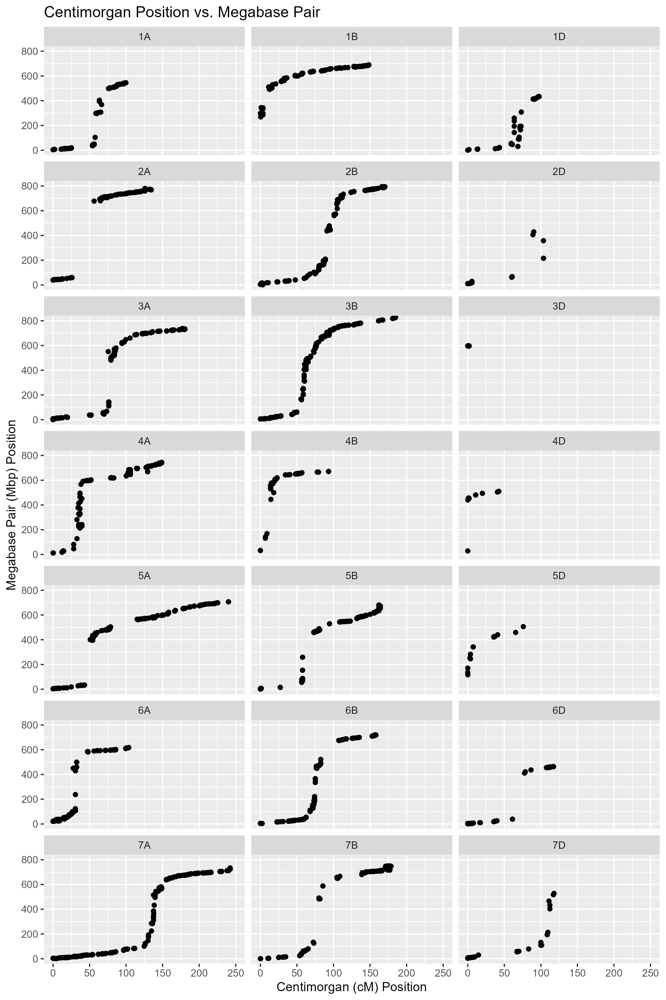

---
title: "Supplemental Information 1"
output: pdf_document
---

## Description

Visualization of linkage map marker centimorgan (cM) versus megabase pair (Mbp) distance. Each subgraph header displays the name of each linkage group (chromosome). The x-axis displays the physical Mbp distance between markers. The y-axis displays the recombination-based cM distance between markers.

\pagebreak

