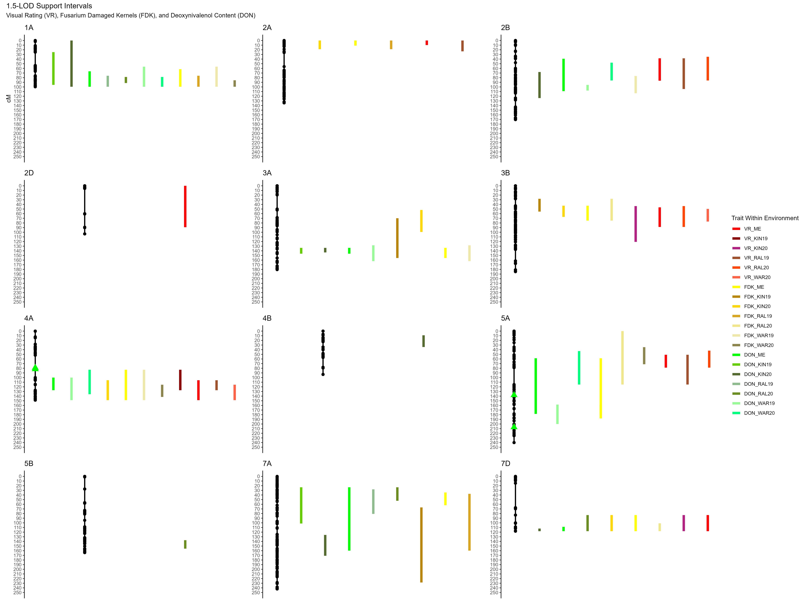

---
title: "Supplemental Information 4"
output: 
  pdf_document:
    extra_dependencies: ["geometry"]
    latex_engine: xelatex
geometry: landscape
---

## Description

A visualization of all 1.5-likelyhood-of-odds (1.5-LOD) support intervals drawn from peak positions of significant quantitative trait locus (QTL) identified for Fusarium head blight (FHB) reaction traits visual rating (VR), Fusarium damaged kernels (FDK) and deoxynivalenol content (DON). Both multi-environmental (ME) and within-environment scans were mapped in this image. Within environment scans included the Cunningham Research Station in Kinston, North Carolina in 2019 (KIN2019) and 2020 (KIN2020); the Lake Wheeler Field Laboratory in Raleigh, North Carolina in 2019 (LW2019) and 2020 (LW2020), and the Eastern Agricultural Research and Extension Center in Warsaw Virginia in 2019 (VIR2019) and 2020 (VIR2020). Support intervals are denoted by bars to the right of linkage groups. The y-axis displays a scale for length of linkage groups in centimorgans (cM). Each linkage group is displayed as a series of points (markers) and a connecting line (distance between markers). The length and position of the bar denotes the length and position of the QTL on the resultant linkage group, which is denoted by the title above the linkage group (e.g., 1A). The color of the corresponding support interval denotes the corresponding scan to which that interval belongs (e.g., visual rating across environments = VR_ME).

